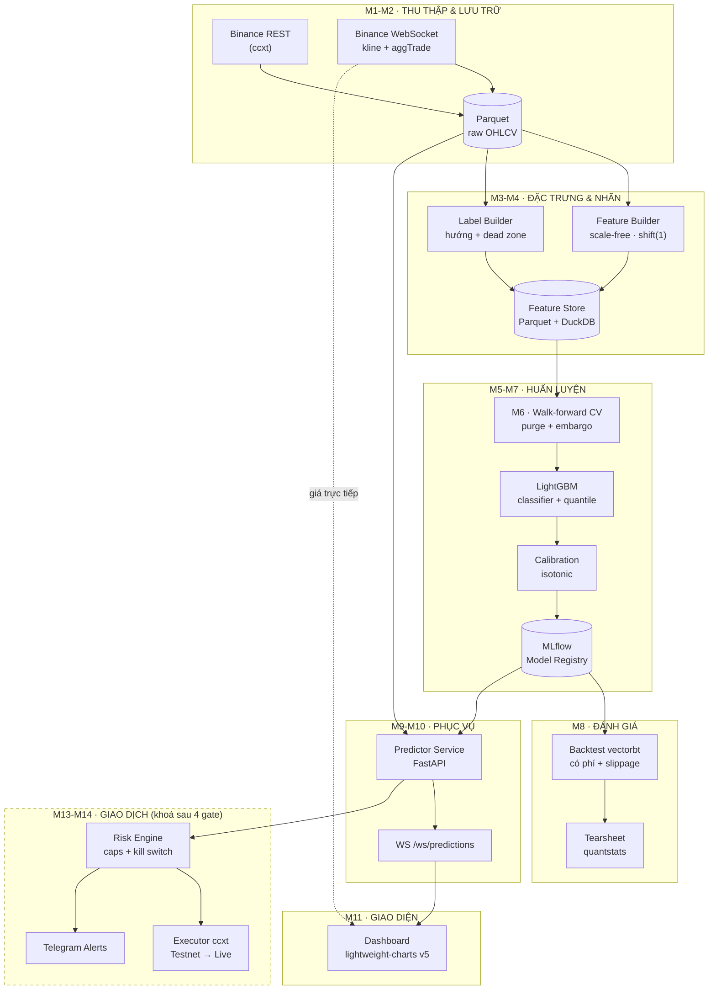

# CRYPTO PREDICTION — KẾ HOẠCH DESIGN TỔNG THỂ

> Phiên bản 1.0 · 24/08/2026 · Dành cho PCT
> Trạng thái: **Bản thiết kế đã chốt scope, chờ duyệt để bắt đầu code**

---

## 0. TÓM TẮT QUYẾT ĐỊNH

Đây là những gì bạn đã chốt qua 3 vòng hỏi đáp. Mọi thiết kế bên dưới đều bám vào bảng này.

| Hạng mục | Quyết định | Hệ quả thiết kế |
|---|---|---|
| Mục tiêu | Học Claude + xây sản phẩm thật | Mỗi module gắn 1-2 feature Claude để thực hành |
| Deliverable | Web dashboard + full pipeline + research repo | 3 lớp: `src/` (pipeline), `web/` (dashboard), `notebooks/` (nghiên cứu) |
| Trình độ | Python cơ bản | Code có comment tiếng Việt, mỗi module có script chạy độc lập |
| Coin | Người dùng tự chọn, giống Binance | **Model phải scale-free** — xem RULE 1 |
| Output | Hướng giá + xác suất | 3 đầu ra: `p_up`, quantile giá, độ biến động |
| Hiển thị | Giá thật + giá dự đoán realtime trên cùng chart | Dự đoán vẽ bằng màu tím, tách hẳn khỏi nến xanh/đỏ |
| Timeframe | 1h–4h (intraday) + 1d (daily) | 2 model riêng, cùng kiến trúc |
| Realtime | Giá chạy liên tục, dự đoán tính lại mỗi khi đóng nến | WebSocket giá + WebSocket dự đoán, hai luồng riêng |
| Ngân sách | Bắt đầu 0đ | Chỉ dùng Binance public API + thư viện MIT/Apache |
| Auto-trade | Có, tiền thật — nhưng đi qua cổng kiểm soát | Kiến trúc dựng sẵn, **mặc định TẮT**, mở qua 4 gate ở §7 |
| Học Claude | Cả cẩm nang riêng + lồng trong module | `docs/01_CLAUDE_HANDBOOK.md` + cột "Claude" trong mỗi module |

---

## 1. MƯỜI HAI NGUYÊN TẮC NỀN TẢNG

Đây là phần quan trọng nhất của tài liệu. Framework nào cũng sẵn sàng đưa cho bạn một backtest đẹp nhưng sai. Mười hai luật này là hàng rào chống lại điều đó. **Mỗi module bên dưới đều tham chiếu ngược về đây.**

---

### RULE 1 — Không bao giờ huấn luyện trên giá tuyệt đối

**Luật:** Mọi feature đưa vào model phải là đại lượng *scale-free* — log return, z-score, tỉ lệ, phần trăm. Tuyệt đối không đưa giá thô (`close = 68450`) hay volume thô vào model.

**Tại sao:** Bạn muốn người dùng chọn bất kỳ coin nào trên Binance. BTC giá 68.000 USD, DOGE giá 0,12 USD. Nếu model học trên giá thô, nó học thuộc lòng dải giá của từng coin và sụp đổ ngay khi gặp coin mới, hoặc khi BTC vượt vùng giá lịch sử. Với feature scale-free, **một model duy nhất phục vụ được toàn bộ 400+ cặp USDT** — đây chính là điều kiện kỹ thuật để đáp ứng yêu cầu "coin do người dùng tự chọn".

**Áp dụng:** `log(close_t / close_{t-1})` thay vì `close`. `volume / rolling_mean(volume, 96)` thay vì `volume`. `(close - EMA20) / ATR14` thay vì `close - EMA20`.

---

### RULE 2 — Mọi feature phải dịch ít nhất một nến

**Luật:** Feature tính từ dữ liệu nến `t` chỉ được dùng để dự đoán nến `t+1` trở đi. Trong code, sau khi tính xong feature phải có một dòng `.shift(1)` rõ ràng, và dòng đó phải có test đi kèm.

**Tại sao:** Đây là lỗi số một của mọi dự án dự đoán crypto. Bạn tính RSI từ giá đóng cửa nến 14:00 rồi dùng nó để "dự đoán" chính nến 14:00. Backtest ra 85% chính xác. Thực tế bằng 0, vì tại 13:30 bạn chưa biết giá đóng cửa 14:00.

**Áp dụng:** Module M6 sẽ có một test tự động: dịch toàn bộ nhãn đi 1 bước rồi train lại — nếu điểm số *tăng*, chắc chắn có rò rỉ.

---

### RULE 3 — Chỉ chia dữ liệu theo thời gian, không bao giờ ngẫu nhiên

**Luật:** Cấm dùng `train_test_split` hay `KFold` thường. Chỉ dùng **walk-forward có purge và embargo** do chính bạn viết.

**Tại sao:** Chia ngẫu nhiên đặt dữ liệu tương lai vào tập train. Thêm nữa, vì nhãn của bạn nhìn về phía trước H nến, mẫu cuối tập train và mẫu đầu tập test *chồng lấn nhau về thời gian* — cần cắt bỏ (purge) H nến ở ranh giới, rồi chờ thêm (embargo) một khoảng nữa.

**Tình hình thư viện 2026:** `mlfinlab` — thư viện phổ biến nhất từng cung cấp sẵn purged CV — **đã đóng mã nguồn và chuyển thành sản phẩm thương mại**. Vẫn còn vài lựa chọn mã nguồn mở ít người biết: `purgedcv` (MIT, v0.1.4 phát hành 22/08/2026, có `PurgedKFold`, `CombinatorialPurgedCV`, `WalkForwardSplit`, tương thích sklearn), `timeseriescv`, `mlfinpy`.

**Vẫn tự viết, nhưng đối chiếu.** Tự viết vì đây là phần bạn *phải* hiểu đến từng dòng — nó quyết định mọi con số sau này nói thật hay nói dối. Sau khi viết xong, chạy song song với `purgedcv` trên cùng bộ dữ liệu: nếu hai bên cho ranh giới fold khác nhau, một trong hai sai và bạn cần biết bên nào.

---

### RULE 4 — Phải đánh bại baseline trước khi tin bất cứ thứ gì

**Luật:** Trước khi train LightGBM, phải chạy và ghi lại điểm của ba baseline: (a) luôn dự đoán "tăng", (b) seasonal-naive, (c) random 50/50. Model chỉ có giá trị nếu thắng cả ba **trên tập out-of-sample, sau khi trừ phí**.

**Tại sao:** Crypto có xu hướng tăng dài hạn. "Luôn mua và giữ" đánh bại phần lớn model machine learning nghiệp dư. Nếu bạn không đo baseline, bạn không biết mình đang thắng cái gì.

---

### RULE 5 — Mọi con số đánh giá đều đã trừ phí và trượt giá

**Luật:** Backtest mặc định phải cấu hình: phí taker Binance spot 0,10% mỗi chiều, trượt giá 0,05%, và với futures thì cộng thêm funding rate 8 giờ/lần.

**Tại sao:** Một chiến lược intraday vào ra 6 lần/ngày đi qua 12 chiều — 12 × (0,10% phí + 0,05% trượt giá) ≈ **1,8% mỗi ngày**. Không edge nghiệp dư nào sống nổi qua con số đó. Rất nhiều repo "70% accuracy" trên GitHub sụp đổ ngay khi bạn bật phí.

---

### RULE 6 — Xác suất phải được hiệu chỉnh, không dùng thô

**Luật:** `predict_proba()` của LightGBM **không phải xác suất thật**. Phải hiệu chỉnh bằng isotonic regression hoặc Platt scaling trên tập validation riêng, rồi kiểm chứng bằng reliability diagram và Brier score.

**Tại sao:** Bạn định hiển thị "độ tin cậy 62%" lên dashboard. Nếu con số đó không được calibrate, khi model nói 62% thì thực tế có thể chỉ đúng 51%. Bạn sẽ đặt cược dựa trên một con số bịa. Đây là ranh giới giữa một dashboard trung thực và một dashboard nguy hiểm.

**Hai cạm bẫy làm hỏng việc hiệu chỉnh — cả hai đều tạo ra một GATE 2 đẹp giả:**

1. **Tập calibration phải được purge và embargo ở CẢ HAI biên.** Nhãn nhìn trước H nến, nên nếu lát calibration nằm sát lát test, chúng chồng lấn H nến. Isotonic sẽ học trên chính kết quả xảy ra bên trong cửa sổ test. Fit lại calibrator **trong từng fold**, không fit một lần rồi dùng chung.
2. **Đo hiệu chỉnh trên toàn bộ nến, không phải tập đã lọc vùng chết.** Ta loại nhãn "đi ngang" khỏi tập *huấn luyện* (§4.4), nên model học `P(tăng | biến động đủ lớn)`. Nhưng dashboard xuất xác suất cho **mọi** nến đóng, kể cả nến đi ngang. Nếu chỉ đo reliability trên tập đã lọc, bạn sẽ qua GATE 2 trong khi con số hiện lên màn hình vẫn lệch. Đo trên toàn bộ nến out-of-sample chưa lọc.

**Kiểm chứng:** Gom tất cả lần model nói "60%". Trong số đó phải có xấp xỉ 60% thật sự tăng. Sai lệch quá ±10% là chưa đạt.

---

### RULE 7 — Giá dự đoán không bao giờ được nhìn giống giá thật

**Luật:** Nến thật dùng xanh/đỏ đặc. Đường dự đoán dùng **màu tím, nét đứt**, kèm dải khoảng tin cậy mờ. Không bao giờ dùng xanh/đỏ cho phần dự đoán.

**Tại sao:** Trên một dashboard realtime, người xem liếc trong 2 giây rồi ra quyết định. Nếu đường dự đoán trông giống dữ liệu thật, sớm muộn bạn cũng đọc nhầm dự đoán thành sự thật — đúng vào lúc căng thẳng nhất.

---

### RULE 8 — Dashboard phải luôn nói thật về độ tươi của dữ liệu

**Luật:** Màn hình luôn có một chỉ báo trạng thái: *Live* (WebSocket khoẻ), *Chậm* (>5s không có tick), *Mất kết nối*, *Dự đoán cũ* (model chưa chạy lại sau khi nến đóng). Khi mất kết nối, giá phải chuyển sang xám và hiện dấu thời gian cập nhật cuối.

**Tại sao:** Chế độ hỏng nguy hiểm nhất của một dashboard realtime không phải là báo lỗi — mà là **im lặng hiển thị số cũ như thể nó vẫn đúng**.

---

### RULE 9 — Tiền thật chỉ mở khoá qua cổng, không bao giờ qua cảm tính

**Luật:** Chuyển sang giao dịch tiền thật chỉ được phép khi vượt đủ 4 gate ở §7, mỗi gate có tiêu chí số cụ thể. Không có ngoại lệ vì "tuần này thấy nó chạy ngon".

**Tại sao:** Bạn đã chọn auto-trade tiền thật. Đó là quyền của bạn, và tôi sẽ dựng đầy đủ kiến trúc cho nó. Nhưng cách duy nhất để việc này không kết thúc bằng một khoản lỗ là quyết định "bật" đã được định nghĩa bằng số *trước khi* bạn có cảm xúc với nó.

---

### RULE 10 — Mỗi thí nghiệm phải tái lập được

**Luật:** Mỗi lần train ghi lại: git commit hash, seed, hash của snapshot dữ liệu, toàn bộ config, và metric — vào MLflow. Không có ngoại lệ, kể cả thí nghiệm "chạy thử cho vui".

**Tại sao:** Ba tuần nữa bạn sẽ thấy một kết quả tốt và không nhớ nổi mình đã dùng feature nào.

---

### RULE 11 — Nghi ngờ mọi độ chính xác trên 60% ở khung ngắn

**Luật:** Nếu directional accuracy trên tập out-of-sample vượt 60% ở khung 1h, **giả định là có rò rỉ dữ liệu cho tới khi chứng minh được điều ngược lại**. Chạy quy trình truy tìm leakage ở M6 trước khi ăn mừng.

**Tại sao:** Thị trường crypto thanh khoản cao ở khung ngắn gần như là random walk. Mức 52–55% đã là một edge thật và đáng giá. Con số 70% mà nhiều repo hướng dẫn quảng cáo hầu như luôn đến từ leakage hoặc từ việc dự đoán một biến tự tương quan tầm thường.

---

### RULE 12 — Foundation model đã nhìn thấy quá khứ của bạn

**Luật:** Nếu dùng Kronos, Chronos hay TimesFM ở giai đoạn sau, chỉ được đánh giá zero-shot trên dữ liệu **sau thời điểm cutoff huấn luyện của model đó**.

**Tại sao:** Các model này được pretrain trên kho dữ liệu khổng lồ nhiều khả năng đã bao gồm chính lịch sử BTC bạn đang backtest. Kết quả trên 2020–2024 không phải out-of-sample.


---

## 2. KIẾN TRÚC TỔNG THỂ



**Ba đường dữ liệu độc lập — đây là điểm mấu chốt của thiết kế realtime:**

1. **Đường giá (nhanh, vài lần/giây):** Trình duyệt nối *thẳng* tới WebSocket Binance. Backend không tham gia. Giá nhảy mượt, không tốn tài nguyên server, và nếu backend chết thì giá vẫn chạy.
2. **Đường dự đoán (chậm, mỗi khi đóng nến):** Backend phát hiện nến đóng → chạy inference → đẩy kết quả qua WebSocket riêng của backend. Mỗi giờ 1 lần (khung 1h), mỗi ngày 1 lần (khung 1d).
3. **Đường lịch sử (một lần khi mở trang):** REST API lấy 500 nến gần nhất để vẽ chart ban đầu.

Tách ba đường này giúp bạn tránh cái bẫy phổ biến nhất: bắt model chạy lại mỗi giây. Trong một nến chưa đóng, dữ liệu đầu vào của model gần như không đổi — chạy lại chỉ tạo ra một con số rung lắc vô nghĩa.

---

## 3. TECH STACK ĐÃ CHỐT

Tôi đã cho một agent rà soát hơn 60 repo trên GitHub. Bảng dưới là lựa chọn cuối, kèm lý do và cả những gì **cố tình loại bỏ**.

### 3.1 Chốt dùng

| Lớp | Thư viện | License | Tại sao chọn |
|---|---|---|---|
| Dữ liệu | **ccxt** (43.7k★, cập nhật hằng ngày) | MIT | Một API cho 100+ sàn. WebSocket đã được gộp vào bản free từ v1.95 — không cần trả phí. |
| Lưu trữ | **Parquet + DuckDB** | MIT | Miễn phí, không cần cài server, truy vấn SQL trên file. Đủ cho vài GB dữ liệu nến. |
| Chỉ báo | **pandas-ta-classic** (MIT) | MIT | 192 chỉ báo, **không cần thư viện C**. Là nhánh còn sống của pandas-ta. |
| Chỉ báo (tuỳ chọn) | **ta-lib-python** | BSD-2 | Nhanh hơn nhiều. Từ v0.6.5 đã có wheel dựng sẵn nên không còn đau đầu cài đặt như xưa. |
| Baseline | **statsforecast** | Apache-2.0 | Seasonal-naive và AutoARIMA để làm mốc so sánh bắt buộc (RULE 4). |
| Model chính | **LightGBM** (18.7k★) | MIT | Trên dữ liệu bảng nhiễu và ít mẫu như crypto, gradient boosting thắng deep learning trong đa số trường hợp. |
| Model phụ | **CatBoost** | Apache-2.0 | Ordered boosting chống rò rỉ nhãn tốt hơn — dùng để đối chiếu. |
| Tinh chỉnh | **Optuna** | MIT | Có pruning. **Bắt buộc tối ưu trên mục tiêu walk-forward**, không phải một backtest cố định. |
| Kiểm định | **Tự viết** (`src/validation/`) + `purgedcv` để đối chiếu | MIT | Xem RULE 3. Tự viết để hiểu; `purgedcv` để kiểm tra chéo ranh giới fold. |
| Backtest | **vectorbt** (8.7k★) | Apache-2.0 + Commons Clause | Quét hàng nghìn tổ hợp tham số trong vài giây. Bản OSS vẫn sống khoẻ (1.1.0 ra tháng 7/2026). |
| Báo cáo | **quantstats** | Apache-2.0 | Một dòng lệnh ra tearsheet đầy đủ Sharpe/Sortino/drawdown. |
| Backend | **FastAPI + uvicorn** | MIT | WebSocket native, async, docs tự sinh. Nhẹ và dễ học. |
| Chart | **TradingView lightweight-charts v5** (16.1k★) | Apache-2.0 | 45KB, nhìn và chạy đúng chuẩn TradingView. |
| Theo dõi | **MLflow** | Apache-2.0 | `pip install mlflow && mlflow ui` là xong. Không cần tài khoản, không phụ thuộc nhà cung cấp. |
| Lập lịch | **APScheduler** → **Prefect** | MIT/Apache | Bắt đầu bằng APScheduler cho đơn giản, lên Prefect khi cần retry và observability. |
| Cảnh báo | **Telegram Bot API** | — | Miễn phí, 5 phút cài đặt. |
| Giao dịch | **ccxt** + risk engine tự viết | MIT | Xem §7. |

### 3.2 Cố tình KHÔNG dùng, và lý do

| Thư viện | Lý do loại |
|---|---|
| `pandas-ta` (bản gốc) | ⚠️ Repo GitHub vẫn truy cập được, nhưng **package PyPI đã đổi tay maintainer, lịch sử release bị cắt còn 2 bản (9/2025), và chuyển hướng sang một tên miền mới — không có giải thích công khai**. Cộng đồng đã nêu quan ngại chuỗi cung ứng và chưa được trả lời. Dùng `pandas-ta-classic`. Nếu đang pin `pandas-ta`, ghim đúng một hash đã biết là an toàn hoặc chuyển đi. |
| `backtrader` | Commit cuối **tháng 4/2023**, 63 PR treo. Bản fork cứu hộ còn chết sớm hơn (2021). Rất nhiều tutorial vẫn dạy nó — đừng theo. |
| `mlfinlab` | Đã **đóng mã nguồn**, chuyển thành sản phẩm thương mại. Repo giờ chỉ là nơi báo lỗi. |
| `finBERT` | Code đứng yên từ 2022, huấn luyện trên văn phong phân tích chứng khoán — kém trên tiếng lóng crypto. |
| `gym-anytrading` | Đứng yên từ 2023, viết trước khi Gym đổi sang Gymnasium. |
| `lightweight-charts-python` | Bản bọc Python đứng yên từ 2024, còn kẹt ở v4 trong khi bản JS đã lên v5.2. **Ta gọi thẳng thư viện JS.** |
| `Prophet` | Thiết kế cho tính mùa vụ của doanh nghiệp, không hợp thị trường đổi chế độ liên tục như crypto. |
| `freqtrade` | Rất mạnh (FreqAI làm sẵn 80% pipeline) nhưng là GPL-3.0 và ép bạn theo cấu trúc của nó. **Không hợp mục tiêu học** — bạn sẽ học freqtrade thay vì học cách xây pipeline. Ghi nhận là phương án B nếu sau 14 tuần bạn muốn đi nhanh. |
| RL (FinRL, TensorTrade) | Vượt xa mức cần thiết. RL trên dữ liệu tài chính nhiễu là bài toán nghiên cứu, không phải bài toán kỹ thuật. |

### 3.3 Để dành cho giai đoạn 2 (sau tuần 14)

- **Kronos** (MIT, ~38k★) — foundation model đầu tiên huấn luyện riêng cho nến K-line, có demo BTC/USDT 24h. Rất đáng thử, nhưng checkpoint lớn nhất chưa phát hành và commit cuối tháng 4/2026. Nhớ RULE 12 khi đánh giá.
- **Chronos-2** (Apache-2.0) — zero-shot có hỗ trợ biến ngoại sinh, chạy nhẹ. Làm "ý kiến thứ hai" bên cạnh LightGBM.
- **Dune Analytics** — dữ liệu on-chain khi bạn sẵn sàng trả phí.

---

## 4. MÔ HÌNH DỮ LIỆU

### 4.1 Bốn tầng dữ liệu

```
data/
├── raw/          # Nguyên bản từ sàn, KHÔNG BAO GIỜ sửa. Có thể tải lại bất cứ lúc nào.
│   └── ohlcv/symbol=BTCUSDT/timeframe=1h/year=2026/data.parquet
├── clean/        # Đã khử trùng lặp, điền khoảng trống, kiểm tra tính liên tục
├── features/     # Đặc trưng scale-free, đã shift(1)
└── labels/       # Nhãn hướng giá theo từng horizon
```

**Nguyên tắc:** `raw/` là bất biến. Mọi lỗi đều sửa ở tầng `clean/` trở đi. Khi nghi ngờ, xoá `clean/` trở xuống và dựng lại.

### 4.2 Vũ trụ coin (coin universe)

Bạn muốn tự do chọn coin như trên Binance. Cách làm:

1. Khi khởi động, gọi `exchange.load_markets()` → lấy toàn bộ cặp spot USDT đang hoạt động (~400 cặp).
2. Lọc theo thanh khoản: volume 30 ngày ≥ 5 triệu USD, đã niêm yết ≥ 180 ngày.
3. **Huấn luyện** trên top 30–50 cặp thanh khoản nhất (đủ đa dạng chế độ thị trường, đủ nhanh để train).
4. **Suy luận** cho *bất kỳ* cặp nào người dùng chọn — nhờ RULE 1, model không quan tâm đó là coin gì.
5. Nếu người dùng chọn một coin ngoài tập huấn luyện, dashboard hiển thị nhãn **"Ngoài tập huấn luyện — độ tin cậy thấp hơn"**. Trung thực với người dùng là một yêu cầu thiết kế, không phải tuỳ chọn.

⚠️ **Bẫy rò rỉ chéo coin — nguy hiểm và dễ bỏ sót nhất khi train gộp nhiều cặp:** Vì ta huấn luyện chung 30–50 cặp và có nhóm feature liên thị trường BTC, việc chia fold **phải cắt trên một trục thời gian toàn cục duy nhất**, áp cùng ranh giới cho mọi symbol. Nếu chia fold riêng cho từng symbol, lát test của coin A sẽ trùng mốc giờ với lát train của coin B — mà các cặp USDT tương quan rất cao trong ngày, nên đây gần như là rò rỉ trực tiếp. Hệ quả thứ hai: tiêu chí "≥6/8 fold có lãi" ở GATE 1 phải hiểu là 8 *lát thời gian* độc lập, không phải 40 cặp coin tương quan — 40 cặp cùng tăng trong một đợt sóng không phải 40 bằng chứng.

⚠️ **Bẫy sống sót (survivorship bias):** Nếu bạn backtest trên top 50 coin *của hôm nay* suốt 3 năm qua, bạn đã âm thầm loại bỏ mọi coin đã bị huỷ niêm yết hoặc về 0. Kết quả sẽ đẹp giả tạo. Cách khắc phục: lưu lại danh sách coin đủ điều kiện **theo từng tháng**, và backtest dùng đúng danh sách của tháng đó.

### 4.3 Bộ đặc trưng (~45 feature)

| Nhóm | Ví dụ | Ghi chú |
|---|---|---|
| Lợi suất | log return 1, 2, 3, 6, 12, 24, 72 nến | Nền tảng của mọi thứ |
| Biến động | realized vol 24/72, ATR14/close, Parkinson vol | Chuẩn hoá theo giá |
| Động lượng | RSI14, MACD hist / ATR, Stochastic, ROC | Đã có sẵn trong pandas-ta-classic |
| Xu hướng | close/EMA20, EMA20/EMA50, EMA50/EMA200 | Dạng tỉ lệ, không phải hiệu |
| Khối lượng | volume z-score, tỉ lệ taker buy, OBV slope | Tỉ lệ taker buy là feature bị đánh giá thấp |
| Hình nến | (high−low)/close, vị trí close trong biên nến | Thông tin vi cấu trúc rẻ tiền |
| Thời gian | sin/cos của giờ trong ngày, thứ trong tuần | Crypto chạy 24/7 nhưng **vẫn có mùa vụ trong ngày** |
| Liên thị trường | lợi suất BTC, lợi suất coin − lợi suất BTC, beta 30 ngày | **Nhóm quan trọng nhất.** BTC kéo cả thị trường; sức mạnh tương đối so với BTC mới là tín hiệu thật |
| Chế độ | phân vị biến động 30 ngày, phân vị volume | Giúp model biết đang ở thị trường yên hay bão |

### 4.4 Nhãn (label)

```python
# Khung 1h, horizon = 4 nến (dự đoán 4 giờ tới)
r_future = log(close[t+4] / close[t])
theta    = 0.3 * rolling_std(log_return, 96)   # vùng chết thích ứng theo biến động

label = +1 if r_future >  theta      # TĂNG
        -1 if r_future < -theta      # GIẢM
         0 otherwise                  # ĐI NGANG — bỏ khỏi tập train
```

**Tại sao có vùng chết:** Nếu bắt model phân loại nhị phân mọi nến, nó sẽ dành phần lớn công suất để đoán nhiễu quanh mốc 0. Vùng chết dạy nó chỉ phát biểu khi có chuyển động đáng kể. Ngưỡng `theta` thích ứng theo biến động, nên vẫn hoạt động đúng ở cả thị trường yên lẫn thị trường bão.

---

## 5. THIẾT KẾ ĐẦU RA CỦA MODEL

Mỗi lần chạy suy luận trả về ba nhóm số. Đây chính là hợp đồng dữ liệu giữa backend và dashboard.

```json
{
  "symbol": "BTCUSDT",
  "timeframe": "1h",
  "horizon_bars": 4,
  "predicted_at": "2026-08-24T14:00:00Z",
  "valid_until": "2026-08-24T18:00:00Z",
  "last_close": 68450.20,

  "direction": "UP",
  "p_up": 0.62,
  "p_up_calibrated": 0.61,
  "confidence_band": "MEDIUM",

  "price_q10": 67980.0,
  "price_q50": 68910.0,
  "price_q90": 69850.0,

  "expected_vol_pct": 1.4,
  "in_training_universe": true,
  "model_version": "lgbm-1h-v3",
  "mlflow_run_id": "a1b2c3d4"
}
```

**Ba đầu ra, ba mục đích:**

| Đầu ra | Sinh từ | Hiển thị ở đâu |
|---|---|---|
| `direction` + `p_up_calibrated` | LightGBM classifier + isotonic calibration | Huy hiệu hướng ▲/▼ + thanh xác suất |
| `price_q10/q50/q90` | LightGBM quantile regression (3 model, objective=`quantile`) | Đường tím nét đứt + dải mờ trên chart |
| `expected_vol_pct` | Mô hình biến động (GARCH đơn giản hoặc realized vol) | Dùng cho position sizing ở M12 |

**Quy tắc phân loại hướng (có vùng chết, khớp RULE 6):**

```
p_up_calibrated > 0.58  →  TĂNG
p_up_calibrated < 0.42  →  GIẢM
còn lại                 →  ĐI NGANG / KHÔNG RÕ
```

Dashboard **phải** hiển thị trạng thái "Không rõ" một cách bình thường, không coi đó là lỗi. Một hệ thống trung thực im lặng phần lớn thời gian.


---

## 6. ROADMAP 14 TUẦN

Giả định ~10 giờ/tuần. (Bản nháp đầu tiên ghi 12 tuần; sau khi cộng ước lượng chi tiết từng module ở `03_MODULE_SPECS.md` thì P5 và P6 không vừa — con số thật là 14.) Mỗi phase có **cổng ra** — không sang phase sau khi chưa đạt.

| Phase | Tuần | Module | Kết quả bàn giao | Cổng ra |
|---|---|---|---|---|
| **P0 · Nền móng** | 1 | M0 | Repo, môi trường, `CLAUDE.md`, tải được 1 năm nến BTC | `python -m cryptopred.data.download BTCUSDT 1h` chạy sạch |
| **P1 · Dữ liệu** | 2–3 | M1, M2, M3 | 3 năm × 40 cặp; feature builder + test chống rò rỉ | Test `test_no_lookahead` xanh |
| **P2 · Kiểm định** | 4–5 | M4, M6 | Nhãn + walk-forward CV có purge/embargo + 3 baseline | Ba baseline có điểm số ghi lại trong MLflow |
| **P3 · Model** | 6–7 | M5, M7 | LightGBM + quantile + calibration | Thắng cả 3 baseline sau phí · **GATE 2** |
| **P4 · Đánh giá** | 8–9 | M8 | Backtest vectorbt + tearsheet quantstats | **GATE 1** (§7) |
| **P5 · Giao diện** | 10–12 | M9, M10, M11 | FastAPI + WebSocket + dashboard realtime | Chart chạy mượt 1 giờ liên tục, không rò bộ nhớ |
| **P6 · Vận hành** | 13–14 | M12, M13 | Telegram alerts + risk engine + shadow run | Mọi giới hạn của risk engine có test vi phạm và bị chặn |
| **P7 · Tiền thật** | 15+ | M14 | Executor có giới hạn cứng | **GATE 3, 4 — tối thiểu 60 ngày chạy thử** |

**Nhận xét thẳng thắn về lịch trình:** Phase 4 là nơi phần lớn dự án chết. Bạn sẽ có một backtest đẹp, rồi phát hiện ra rò rỉ, rồi con số tụt xuống quanh 51%. Đó **không phải thất bại** — đó là lần đầu tiên bạn nhìn thấy sự thật. Kế hoạch này dành trọn hai tuần cho nó vì lý do đó.

---

## 7. BỐN CỔNG BẮT BUỘC TRƯỚC KHI DÙNG TIỀN THẬT

Bạn đã chọn auto-trade tiền thật. Tôi sẽ dựng đầy đủ kiến trúc cho việc đó. Điều kiện là quyết định "bật" phải được định nghĩa bằng số **ngay bây giờ**, khi bạn còn chưa có cảm xúc gắn với kết quả nào.

### GATE 1 — Thống kê (cuối Phase 4)

| Tiêu chí | Ngưỡng |
|---|---|
| Số fold walk-forward | ≥ 8, trải ≥ 24 tháng |
| Sharpe ratio sau phí + slippage | ≥ 1.0 |
| Max drawdown | ≤ 25% |
| Profit factor | ≥ 1.2 |
| Tính ổn định | ≥ 6/8 fold có lãi — **không được để 1 fold gánh toàn bộ lợi nhuận** |
| Thắng baseline buy-and-hold | Có, sau khi trừ phí |

> ⚠️ **GATE 1 không được chấm trên chính bộ fold mà Optuna đã tối ưu.** Nếu bạn tinh chỉnh siêu tham số để tối đa điểm trung bình walk-forward rồi lấy đúng điểm đó làm tiêu chí, con số bạn đọc là kết quả của việc *chọn lọc*, không phải out-of-sample. Cách làm đúng: giữ một giai đoạn cuối (khuyến nghị 6 tháng gần nhất) **chưa từng chạm vào trong bất kỳ vòng tinh chỉnh nào**, và chấm GATE 1 trên đó. Nếu muốn dùng toàn bộ fold, phải dùng deflated Sharpe hiệu chỉnh theo số trial đã chạy.

### GATE 2 — Hiệu chỉnh xác suất

| Tiêu chí | Ngưỡng |
|---|---|
| Brier score | Tốt hơn baseline luôn-dự-đoán-tần-suất-nền |
| Reliability diagram | Nằm trong ±10% quanh đường chéo ở mọi bin |
| Kiểm chứng bằng lời | Trong các lần model nói "60%", thực tế phải tăng ~60% số lần |

### GATE 3 — Chạy thật bằng tiền ảo

| Tiêu chí | Ngưỡng |
|---|---|
| Thời gian | ≥ 60 ngày liên tục trên Binance Testnet |
| Số lệnh | ≥ 100 |
| Độ khớp với backtest | PnL thực tế nằm trong ±30% so với backtest cùng kỳ |
| Sự cố kỹ thuật | 0 lệnh trùng, 0 lệnh mồ côi, 0 lần lệch trạng thái |

> Nếu kết quả lệch quá xa backtest, **vấn đề nằm ở backtest, không phải ở thị trường.** Quay lại Phase 4.

⚠️ **Testnet chứng minh đường ống, không chứng minh PnL.** Binance Testnet có sổ lệnh riêng và rất mỏng — giá ở đó không bám 1:1 giá thật. Vì vậy GATE 3 phải tách làm hai vế chạy song song:
>
> - **Vế A — Testnet:** chứng minh phần kỹ thuật. Idempotency, đối soát, xử lý lỗi, kill switch. Tiêu chí là "0 sự cố", **không** phải PnL.
> - **Vế B — Shadow run trên dữ liệu mainnet thật:** hệ thống chạy đầy đủ trên giá thật và ghi lại lệnh nó *sẽ* đặt, nhưng không gửi đi. Khớp lệnh mô phỏng ở giá thật cộng phí và trượt giá. Tiêu chí ±30% so với backtest được chấm ở vế này, không phải ở Testnet.

### GATE 4 — An toàn kỹ thuật

Bắt buộc có đủ, mỗi thứ đều phải được kiểm thử:

- [ ] **Kill switch** — một lệnh/một nút dừng toàn bộ và huỷ mọi lệnh chờ
- [ ] **Giới hạn lỗ ngày** — lỗ 2% vốn trong ngày → tự tắt, **không tự bật lại**
- [ ] **Giới hạn vị thế** — ≤ 1% vốn mỗi lệnh, ≤ 5% tổng exposure khi mới bắt đầu
- [ ] **Idempotent order** — mỗi lệnh có `clientOrderId` duy nhất, gửi lại không tạo lệnh mới
- [ ] **Đối soát** — mỗi 5 phút so trạng thái nội bộ với số dư thật trên sàn, lệch là báo động
- [ ] **API key giới hạn** — bật quyền giao dịch, **TẮT quyền rút tiền**, khoá theo IP
- [ ] **Heartbeat** — mất kết nối > 60 giây → đóng vị thế hoặc chuyển sang chế độ an toàn
- [ ] **Cắt lỗ từng vị thế** — stop-loss theo bội số ATR (khuyến nghị 1,5×ATR14), đặt cùng lúc với lệnh vào, không đặt sau
- [ ] **Thời gian giữ tối đa** — hết horizon (4 nến với khung 1h) mà chưa chạm mục tiêu thì thoát theo giá thị trường; không giữ vị thế mồ côi sau khi tín hiệu đã hết hạn
- [ ] **Quy tắc thoát khi tín hiệu đổi** — dự đoán mới rơi vào vùng "KHÔNG RÕ" thì đóng vị thế đang mở, không chờ
- [ ] **Chế độ thủ công** — mọi lần khởi động lại đều bắt đầu ở trạng thái TẮT, phải bật tay

> **Định nghĩa lối ra trước khi viết lối vào.** Ba mục đầu ở trên là lối ra. Một hệ thống biết khi nào vào mà không biết khi nào ra sẽ tích luỹ những vị thế không ai còn lý do để giữ.

### Nói thẳng một lần

Vượt cả bốn cổng **không** có nghĩa là bạn sẽ có lãi. Backtest tốt là điều kiện cần, không phải điều kiện đủ. Thị trường đổi chế độ, edge mòn đi, và phần lớn hệ thống giao dịch tự động cá nhân đều lỗ. Bốn cổng này giúp bạn loại bỏ những cách thua *có thể tránh được* — lỗi kỹ thuật, rò rỉ dữ liệu, tự lừa mình. Chúng không loại bỏ được rủi ro thị trường. Tôi không phải cố vấn tài chính và tài liệu này không phải lời khuyên đầu tư; hãy tự quyết định số vốn bạn chấp nhận mất hoàn toàn.

---

## 8. BẢN ĐỒ HỌC CLAUDE THEO MODULE

Mỗi module dạy 1–2 tính năng. Học tới đâu dùng tới đó — đây là cách nhớ lâu nhất.

| Module | Tính năng Claude | Bạn sẽ tự tay làm gì |
|---|---|---|
| M0 Nền móng | **Plan Mode**, **CLAUDE.md**, **Project Instructions**, **Memory** | Viết `CLAUDE.md` cho repo; lưu quyết định kiến trúc vào memory |
| M1 Thu thập | **Bash tool**, **WebSearch**, **Subagent** | Cho subagent đọc tài liệu API Binance trong khi bạn viết code |
| M2 Lưu trữ | **Task list**, **Artifacts** | Dựng sơ đồ tầng dữ liệu thành artifact |
| M3 Đặc trưng | **Skills** | Viết skill riêng `feature-guardrails` tự nhắc RULE 1 và RULE 2 mỗi lần thêm feature |
| M4 Nhãn | **Subagent phản biện** | Giao agent nhiệm vụ *cố chứng minh* nhãn của bạn bị rò rỉ |
| M5 Model | **MLflow + Bash**, **Slash command** | Tạo lệnh tắt `/train` chạy full pipeline |
| M6 Kiểm định | **Hooks** | Hook pre-commit chặn commit nếu test chống rò rỉ đỏ |
| M7 Calibration | **Data skills**, **dataviz** | Vẽ reliability diagram đúng chuẩn |
| M8 Backtest | **Subagent song song** | Nhiều agent cùng backtest nhiều khung/tham số |
| M9 Backend API | **MCP** | Viết MCP server riêng cho dữ liệu Binance để dùng lại ở mọi phiên |
| M10 Suy luận | **Scheduled tasks** | Đặt lịch retrain hằng đêm và gửi báo cáo sáng |
| M11 Dashboard | **Artifacts**, **Claude in Chrome** | Prototype bằng artifact trước; sau đó để Claude mở dashboard, chụp màn hình, đọc console tự tìm lỗi |
| M12 Cảnh báo | **Monitor** | Theo dõi tiến trình chạy nền, báo khi bot im lặng bất thường |
| M13 Risk Engine | **Git/PR review** | Claude review PR với vai trò kỹ sư hoài nghi trước khi merge code động tới tiền |
| M14 Executor | **Hooks + Monitor** | Giám sát log, báo động khi trạng thái nội bộ lệch khỏi sàn |

Chi tiết từng tính năng nằm ở `docs/01_CLAUDE_HANDBOOK.md`.

---

## 9. CẤU TRÚC THƯ MỤC

```
Crypto_Prediction/
├── CLAUDE.md                    # Hướng dẫn Claude khi làm việc trong repo này
├── README.md
├── pyproject.toml
├── .env.example                 # Mẫu biến môi trường — KHÔNG commit .env thật
├── docs/
│   ├── 00_MASTER_PLAN.md        # ← bạn đang đọc
│   ├── 01_CLAUDE_HANDBOOK.md    # Cẩm nang toàn bộ tính năng Claude
│   ├── 02_DESIGN_SYSTEM.md      # Design system cho dashboard
│   ├── 03_MODULE_SPECS.md       # Đặc tả chi tiết M0–M14
│   └── adr/                     # Nhật ký quyết định kiến trúc
├── config/
│   ├── symbols.yaml             # Bộ lọc vũ trụ coin
│   ├── features.yaml            # Khai báo feature
│   └── model.yaml               # Siêu tham số
├── src/cryptopred/
│   ├── data/                    # M1, M2 — tải & lưu trữ
│   ├── features/                # M3 — đặc trưng scale-free
│   ├── labels/                  # M4 — nhãn có vùng chết
│   ├── validation/              # M6 — ★ QUAN TRỌNG NHẤT: purged walk-forward
│   ├── models/                  # M5, M7 — train & calibrate
│   ├── backtest/                # M8 — vectorbt + quantstats
│   ├── serving/                 # M9, M10 — FastAPI + WebSocket
│   ├── risk/                    # M13 — giới hạn & kill switch
│   ├── execution/               # M14 — ccxt executor
│   └── notify/                  # M12 — Telegram
├── web/
│   ├── index.html
│   ├── tokens.css               # ← design tokens, nguồn chân lý duy nhất về màu
│   ├── components.css
│   └── app.js
├── notebooks/                   # Nghiên cứu, thăm dò — KHÔNG chứa logic sản xuất
├── tests/
│   └── test_leakage.py          # ★ Test quan trọng nhất trong repo
└── scripts/
```

**Một quy tắc về notebook:** Notebook dùng để *khám phá*, không bao giờ để *chạy thật*. Mọi logic đã ổn định phải chuyển vào `src/` và có test. Notebook không có test là nơi lỗi rò rỉ ẩn náu.

---

## 10. BƯỚC TIẾP THEO NGAY

Khi bạn duyệt kế hoạch này, thứ tự việc sẽ là:

1. **Tôi dựng khung repo** — `pyproject.toml`, cấu trúc thư mục, `CLAUDE.md`, `.env.example`, và script tải dữ liệu chạy được ngay.
2. **Bạn chạy thử một lệnh** — tải 1 năm nến BTC 1h về máy, xác nhận môi trường ổn.
3. **Ta làm M3 + M6 song song** — feature builder và bộ kiểm định. Tôi cố tình để hai module này cạnh nhau vì bộ kiểm định phải tồn tại *trước khi* bạn có model nào để tự lừa mình.

Ba câu hỏi còn mở, có thể trả lời sau, không chặn việc bắt đầu:

- Có muốn tôi dựng **MCP server riêng cho Binance** ngay từ đầu không? Lợi ích là mọi phiên Claude sau này đều truy vấn được dữ liệu của bạn trực tiếp.
- Dashboard chạy **localhost** hay bạn muốn tính đường deploy lên VPS ngay từ khâu thiết kế?
- Comment trong code viết **tiếng Việt hay tiếng Anh**? (Tôi mặc định tiếng Việt cho phần giải thích, tiếng Anh cho tên hàm/biến.)

---

*Tài liệu liên quan: `01_CLAUDE_HANDBOOK.md` · `02_DESIGN_SYSTEM.md` · `03_MODULE_SPECS.md`*
