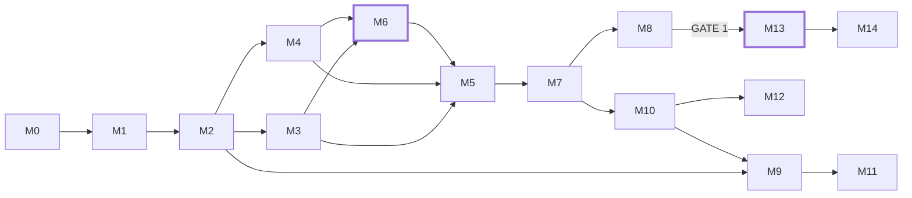

# ĐẶC TẢ MODULE — M0 đến M14

> Phiên bản 1.0 · 24/08/2026
> Mỗi module là một đơn vị làm việc độc lập: có input rõ, output rõ, tiêu chí hoàn thành đo được, và một tính năng Claude để thực hành.
> Ký hiệu ★ đánh dấu module quan trọng nhất — đừng rút gọn chúng.

---

## M0 · NỀN MÓNG

| | |
|---|---|
| **Mục tiêu** | Dựng repo chạy được, môi trường ổn định, Claude hiểu ngữ cảnh dự án |
| **Input** | Không |
| **Output** | Cây thư mục, `pyproject.toml`, `CLAUDE.md`, `.env.example`, `make` targets |
| **Thư viện** | `uv` hoặc `venv`, `ruff`, `pytest` |
| **Thời gian** | 1 tuần |

**Việc cụ thể**

1. Tạo cấu trúc thư mục theo §9 kế hoạch tổng thể.
2. Viết `CLAUDE.md` — file này quyết định chất lượng mọi phiên làm việc sau. Nội dung tối thiểu: mục đích dự án, 12 RULE nền tảng (dạng rút gọn), quy ước đặt tên, lệnh chạy test, và **cảnh báo rằng module `validation/` không được sửa nếu không có test đi kèm**.
3. `.env.example` với `BINANCE_API_KEY`, `BINANCE_API_SECRET`, `TELEGRAM_BOT_TOKEN` — để trống. Thêm `.env` vào `.gitignore` **trước commit đầu tiên**.
4. Cấu hình `ruff` + `pytest`, thêm target `make test`, `make lint`, `make train`.

**Definition of Done**
- [ ] `make test` chạy và pass (kể cả khi mới chỉ có 1 test giả)
- [ ] `git status` không thấy `.env` hay `data/`
- [ ] Mở một phiên Claude mới, hỏi "dự án này làm gì?" → trả lời đúng nhờ `CLAUDE.md`

**Học Claude:** Plan Mode · CLAUDE.md · Project Instructions · Memory
> Thực hành: bật Plan Mode, mô tả module tiếp theo, để Claude lập kế hoạch trước khi viết một dòng code nào. So sánh với việc nhảy vào code luôn — bạn sẽ thấy khác biệt ngay ở module này.

---

## M1 · THU THẬP DỮ LIỆU

| | |
|---|---|
| **Mục tiêu** | Tải và lưu lịch sử nến của toàn bộ vũ trụ coin, có thể chạy lại nhiều lần an toàn |
| **Input** | `config/symbols.yaml` |
| **Output** | `data/raw/ohlcv/symbol=*/timeframe=*/*.parquet` |
| **Thư viện** | `ccxt` (MIT) |
| **Thời gian** | 4–5 ngày |

**Việc cụ thể**

1. `load_markets()` → lọc cặp spot USDT đang hoạt động.
2. Lọc thanh khoản: volume 30 ngày ≥ 5 triệu USD, niêm yết ≥ 180 ngày. **Ghi lại danh sách đủ điều kiện theo từng tháng** để tránh bẫy sống sót.
3. Tải phân trang `fetch_ohlcv` — Binance giới hạn 1000 nến/lần, có rate limit. Dùng `exchange.enableRateLimit = True`.
4. Chạy lại được (idempotent): chỉ tải phần còn thiếu, khử trùng lặp theo timestamp.
5. Ghi Parquet phân vùng theo `symbol` / `timeframe` / `year`.

**Cạm bẫy**
- Sàn thỉnh thoảng **sửa lại nến cũ**. Đừng giả định dữ liệu bất biến — khi tải lại, so sánh và ghi log chênh lệch.
- Chuỗi thời gian **có lỗ hổng** (sàn bảo trì). Đừng giả định index liên tục.

**Definition of Done**
- [ ] Tải được 3 năm × 40 cặp × 3 khung mà không lỗi
- [ ] Chạy lại lần hai không tạo bản ghi trùng
- [ ] Có test: `assert df.index.is_monotonic_increasing and df.index.is_unique`

**Học Claude:** Bash tool · WebSearch · Subagent
> Thực hành: giao một subagent đọc tài liệu API Binance và tổng hợp rate limit + giới hạn phân trang, trong khi bạn viết phần khung của downloader.

---

## M2 · LƯU TRỮ & TRUY VẤN

| | |
|---|---|
| **Mục tiêu** | Lớp đọc dữ liệu nhanh, một API duy nhất cho mọi module phía sau |
| **Input** | `data/raw/` |
| **Output** | `data/clean/` + module `cryptopred.data.store` |
| **Thư viện** | `duckdb`, `pyarrow` |
| **Thời gian** | 2–3 ngày |

**Việc cụ thể**

1. Bước làm sạch: khử trùng lặp, sắp xếp, đánh dấu lỗ hổng (**không điền bừa** — đánh dấu để module sau tự quyết).
2. Kiểm tra chất lượng: giá ≤ 0, high < low, volume âm, nhảy giá > 50% trong một nến (có thể thật, cần log để xem).
3. API duy nhất: `store.get_ohlcv(symbol, timeframe, start, end) -> DataFrame`.

**Definition of Done**
- [ ] Truy vấn 1 năm nến 1h của 1 coin < 200ms
- [ ] Báo cáo chất lượng dữ liệu in ra số lỗ hổng và điểm bất thường mỗi coin

**Học Claude:** Task list · Artifacts
> Thực hành: yêu cầu Claude dựng sơ đồ luồng dữ liệu 4 tầng thành một artifact để dán vào tài liệu.

---

## M3 · ĐẶC TRƯNG ★

| | |
|---|---|
| **Mục tiêu** | Sinh ~45 đặc trưng **scale-free**, đã dịch thời gian, không rò rỉ |
| **Input** | `data/clean/` |
| **Output** | `data/features/` |
| **Thư viện** | **`hexital`** (MIT, tăng dần O(1)) — nguồn chân lý duy nhất · `pandas-ta-classic` chỉ để thăm dò trong notebook |
| **Liên quan** | RULE 1, RULE 2 |
| **Thời gian** | 1 tuần |

**Việc cụ thể**

1. **Viết một cài đặt chỉ báo duy nhất bằng `hexital`, dùng chung cho backtest và live.** Đây là yêu cầu kiến trúc, không phải tối ưu hoá — xem S-RULE 2 ở `05_STREAMING_ARCHITECTURE.md`. Train bằng `pandas-ta` rồi phục vụ bằng thư viện khác sẽ tạo **train/serve skew**: model gặp một phân phối hơi lệch so với lúc học, không có exception nào, chỉ có hiệu suất live tệ hơn backtest mà không rõ lý do.
2. Nếu dùng `pandas-ta-classic` để thăm dò, nhớ **không phải `pandas-ta`** (package PyPI đã đổi tay maintainer, lịch sử release bị cắt — rủi ro chuỗi cung ứng).
2. Sinh feature theo 9 nhóm ở §4.3 kế hoạch tổng thể.
3. **Mỗi feature đi qua một hàm bọc duy nhất** áp `.shift(1)` — không để bất kỳ đường vòng nào.
4. Nhóm liên thị trường: nạp lợi suất BTC, tính lợi suất tương đối và beta 30 ngày. Đây là nhóm feature giá trị nhất và cũng dễ rò rỉ nhất (phải căn đúng timestamp giữa hai coin).
5. Chuẩn hoá **bên trong mỗi fold**, không bao giờ trên toàn chuỗi.

**Cạm bẫy**
- **`pandas.ewm(adjust=True)` — mặc định — không phải công thức EMA đệ quy.** Nó hội tụ về `adjust=False` nhưng khác rõ rệt trong giai đoạn khởi động. Đây là nguồn train/serve skew phổ biến nhất.
- **Chỉ báo làm mượt kiểu Wilder (RSI, ATR, ADX) có bộ nhớ vô hạn** — bản khởi động từ nến 500 không bao giờ bằng chính xác bản tính từ nến 0. Phải làm ấm tối thiểu **5 lần chu kỳ dài nhất** (EMA200 ⇒ 1.000 nến) trước khi tin giá trị.
- Cửa sổ trượt căn giữa (`center=True`) là rò rỉ tương lai. Cấm.
- Chỉ báo có giai đoạn khởi động (EMA200 cần 200 nến). Tính lại **trong từng fold**, đừng tính một lần trên cả chuỗi rồi cắt.
- `fillna(method='bfill')` kéo dữ liệu tương lai về quá khứ. Cấm `bfill`, chỉ dùng `ffill`.

**Definition of Done**
- [ ] `test_incremental_matches_batch` — bản tăng dần khớp bản batch tới 1e-9 **sau warmup**
- [ ] Vector có cờ `warmed_up`; `warmed_up=False` thì **không được** đưa vào predict
- [ ] `test_no_lookahead` xanh (xem M6)
- [ ] Không feature nào có tương quan > 0.99 với nhãn (dấu hiệu rò rỉ kinh điển)
- [ ] Ma trận feature không có NaN sau giai đoạn khởi động

**Học Claude:** Skills
> Thực hành: viết một skill `feature-guardrails` chứa RULE 1 + RULE 2 và danh sách cạm bẫy trên. Từ đó mỗi lần bạn nhờ Claude thêm feature mới, skill tự kích hoạt và Claude tự kiểm tra hai luật này. Đây là bài tập cho thấy rõ nhất sức mạnh của skill.

---

## M4 · NHÃN

| | |
|---|---|
| **Mục tiêu** | Sinh nhãn hướng có vùng chết thích ứng |
| **Input** | `data/clean/` |
| **Output** | `data/labels/` |
| **Liên quan** | RULE 2 |
| **Thời gian** | 2–3 ngày |

Công thức ở §4.4 kế hoạch tổng thể. Ba horizon: 1h→4 nến, 4h→6 nến, 1d→1 nến.

**Definition of Done**
- [ ] Phân bố nhãn cân đối hợp lý (không lệch quá 60/40 giữa tăng và giảm)
- [ ] Nhãn `t` chỉ phụ thuộc dữ liệu `> t` — có test khẳng định điều này

**Học Claude:** Subagent phản biện
> Thực hành: giao một subagent nhiệm vụ **"hãy cố chứng minh bộ nhãn này bị rò rỉ"**. Prompt đối kháng tìm ra thứ mà prompt xác nhận bỏ sót. Đây là kỹ thuật đáng giá nhất trong toàn bộ dự án.

---

## M5 · MODEL

| | |
|---|---|
| **Mục tiêu** | LightGBM classifier (hướng) + 3 quantile regressor (dải giá) |
| **Input** | features + labels |
| **Output** | Model đã lưu trong MLflow |
| **Thư viện** | `lightgbm`, `catboost`, `optuna`, `mlflow` |
| **Liên quan** | RULE 4, RULE 10 |
| **Thời gian** | 1 tuần |

**Việc cụ thể**

1. **Chạy 3 baseline trước** (RULE 4): luôn-tăng, seasonal-naive, random. Ghi vào MLflow.
2. LightGBM classifier → `p_up`.
3. Ba LightGBM regressor với `objective='quantile'`, `alpha` = 0.1 / 0.5 / 0.9 → dải giá.
4. CatBoost để đối chiếu (ordered boosting kháng rò rỉ nhãn tốt hơn).
5. Optuna — **mục tiêu tối ưu phải là điểm trung bình walk-forward**, không phải một backtest cố định.

**Cạm bẫy — thiên lệch chọn lọc:** Chạy 1000 trial Optuna trên một giai đoạn cố định là cách chắc chắn nhất để overfit backtest. Nhưng có một bẫy tinh vi hơn: nếu bạn tối ưu trên điểm trung bình walk-forward *rồi lấy đúng điểm đó* làm tiêu chí GATE 1, con số bạn đọc là kết quả của việc chọn lọc, không phải out-of-sample.

**Bắt buộc:** Cắt riêng **6 tháng gần nhất làm holdout, khoá lại, không chạm vào trong bất kỳ vòng tinh chỉnh nào.** GATE 1 chấm trên holdout đó. Nếu buộc phải chấm trên toàn bộ fold, dùng deflated Sharpe hiệu chỉnh theo số trial đã chạy.

**Definition of Done**
- [ ] Thắng cả 3 baseline trên out-of-sample sau phí
- [ ] Mọi lần chạy đều có trong MLflow kèm git hash và seed
- [ ] Nếu accuracy > 60% ở khung 1h → **kích hoạt quy trình truy tìm rò rỉ M6 trước khi tin** (RULE 11)

**Học Claude:** MLflow + Bash · Slash command
> Thực hành: tạo lệnh tắt `/train <symbol> <timeframe>` chạy toàn bộ pipeline và in bảng so sánh với baseline.

---

## M6 · KIỂM ĐỊNH ★★★ — MODULE QUAN TRỌNG NHẤT

| | |
|---|---|
| **Mục tiêu** | Bộ khung walk-forward có purge + embargo, và bộ dò rò rỉ |
| **Input** | features + labels |
| **Output** | `cryptopred.validation` + `tests/test_leakage.py` |
| **Thư viện** | Tự viết + `purgedcv` (MIT) để đối chiếu |
| **Liên quan** | RULE 2, RULE 3, RULE 11 |
| **Thời gian** | 1 tuần — **đừng rút ngắn** |

**Tại sao module này đứng riêng:** `mlfinlab` — thư viện phổ biến nhất từng cung cấp sẵn purged CV — **đã đóng mã nguồn** và chuyển thành sản phẩm thương mại. Vẫn còn lựa chọn mã nguồn mở ít người biết: `purgedcv` (MIT, v0.1.4 ngày 22/08/2026, tương thích sklearn, có `PurgedKFold` / `CombinatorialPurgedCV` / `WalkForwardSplit`), `timeseriescv`, `mlfinpy`.

**Vẫn tự viết — nhưng đối chiếu.** Tự viết vì đây là phần bạn phải hiểu đến từng dòng: nó quyết định mọi con số sau này nói thật hay nói dối, và bạn không thể debug một backtest đáng ngờ nếu bộ chia fold là hộp đen. Sau khi viết xong, chạy song song với `purgedcv` trên cùng dữ liệu và so ranh giới từng fold. Lệch nhau nghĩa là một trong hai sai — và bạn cần biết bên nào trước khi tin bất kỳ kết quả nào.

**Việc cụ thể**

1. **Purged walk-forward split**

```
|--- train ---|  purge  |--- test ---|  embargo  |--- train ---| ...
                (H nến)               (H nến)
```

`purge` cắt bỏ H nến cuối tập train vì nhãn của chúng nhìn vào vùng test. `embargo` chờ thêm H nến sau test trước khi dữ liệu đó được dùng để train ở fold sau.

⚠️ **Ranh giới fold phải nằm trên một trục thời gian toàn cục duy nhất, áp cùng một mốc cho mọi symbol.** Ta train gộp 30–50 cặp và có feature liên thị trường BTC. Nếu chia fold riêng cho từng coin, lát test của coin A trùng mốc giờ với lát train của coin B — mà các cặp USDT tương quan rất cao trong ngày. Đây là rò rỉ gần như trực tiếp và rất khó phát hiện qua các phép thử thông thường.

2. **Bộ dò rò rỉ — 5 phép thử tự động**

| Phép thử | Cách làm | Dấu hiệu rò rỉ |
|---|---|---|
| Dịch nhãn | Dịch toàn bộ nhãn thêm 1 bước, train lại | Điểm số **tăng** → rò rỉ chắc chắn |
| Xáo trộn nhãn | Xáo ngẫu nhiên nhãn, train lại | Điểm số vẫn > 50% đáng kể → rò rỉ |
| Tương quan feature | `corr(feature, label)` | Bất kỳ feature nào > 0.99 → rò rỉ |
| Ranh giới chéo coin | Kiểm tra mọi symbol dùng chung một mốc cắt fold | Mốc cắt khác nhau giữa các coin → rò rỉ chéo |
| Kiểm tra ranh giới | So mẫu cuối train và đầu test | Chồng lấn thời gian → purge sai |

> Một phép thử **cố tình không đưa vào danh sách**: "train trên tương lai, test trên quá khứ". Nhiều hướng dẫn coi kết quả tương đương ở phép thử này là bằng chứng rò rỉ — không đúng. Một tín hiệu dừng hợp lệ (ví dụ hiệu ứng mean-reversion ổn định qua nhiều năm) cũng cho kết quả tương đương. Dùng nó bạn sẽ vứt đi những model tốt.

3. Chỉ số đánh giá: directional accuracy, Brier score, log loss, AUC, **và** Sharpe sau phí (chỉ số duy nhất thực sự quan trọng).

**Definition of Done**
- [ ] Cả 5 phép thử chạy tự động trong `pytest`
- [ ] Hook pre-commit chặn commit nếu bất kỳ phép thử nào đỏ
- [ ] Một tài liệu ngắn `docs/adr/001-validation.md` giải thích lựa chọn purge/embargo

**Học Claude:** Hooks
> Thực hành: viết hook `PreToolUse` chạy `pytest tests/test_leakage.py` trước mỗi commit và **chặn** nếu đỏ. Đây là ví dụ hoàn hảo về hook: một luật bạn biết là đúng nhưng chắc chắn sẽ quên vào lúc 11 giờ đêm.

---

## M7 · HIỆU CHỈNH XÁC SUẤT

| | |
|---|---|
| **Mục tiêu** | Biến điểm số thô thành xác suất đáng tin |
| **Input** | `p_up` thô |
| **Output** | `p_up_calibrated` + biểu đồ reliability |
| **Thư viện** | `sklearn.calibration` |
| **Liên quan** | RULE 6 |
| **Thời gian** | 3–4 ngày |

Isotonic regression trên một tập validation **riêng biệt** (không phải tập test). Kiểm chứng bằng reliability diagram và Brier score.

**Hai điều kiện bắt buộc — bỏ qua là GATE 2 sẽ đẹp giả:**

1. **Lát calibration phải được purge và embargo ở CẢ HAI biên**, đúng như tập test. Nhãn nhìn trước H nến; nếu lát calibration nằm sát lát test, chúng chồng lấn H nến và isotonic sẽ học trên chính kết quả xảy ra bên trong cửa sổ test. Fit lại calibrator **trong từng fold**, không fit một lần rồi dùng chung mọi fold.
2. **Đo reliability trên toàn bộ nến out-of-sample chưa lọc vùng chết.** M4 loại nhãn "đi ngang" khỏi tập *huấn luyện*, nên model học `P(tăng | biến động đủ lớn)`. Nhưng M10 xuất xác suất cho **mọi** nến đóng, kể cả nến đi ngang. Đo trên tập đã lọc thì bạn qua GATE 2 trong khi con số hiện lên dashboard vẫn lệch. Nếu chênh lệch giữa hai cách đo quá lớn, chuyển sang phân loại 3 lớp (tăng / ngang / giảm) thay vì nhị phân.

**Definition of Done**
- [ ] Reliability diagram nằm trong ±10% quanh đường chéo ở mọi bin có ≥50 mẫu, **đo trên tập chưa lọc vùng chết**
- [ ] Brier score tốt hơn baseline
- [ ] Diễn giải được bằng lời: "trong các lần model nói 60%, thực tế tăng ~60%"

**Học Claude:** dataviz skill
> Thực hành: đọc skill `dataviz` trước khi vẽ reliability diagram. Nó sẽ chỉ ra rằng biểu đồ này cần đường tham chiếu, khoảng tin cậy, và cỡ mẫu mỗi bin — ba thứ hầu hết người mới bỏ quên.

---

## M8 · BACKTEST & ĐÁNH GIÁ

| | |
|---|---|
| **Mục tiêu** | Đo hiệu quả kinh tế thật, có phí, trên nhiều fold |
| **Input** | Dự đoán ra khỏi mẫu |
| **Output** | Tearsheet + bảng chỉ số |
| **Thư viện** | `vectorbt`, `quantstats` |
| **Liên quan** | RULE 5, GATE 1 |
| **Thời gian** | 1 tuần |

Cấu hình bắt buộc: phí taker 0,10% mỗi chiều, slippage 0,05%. Chạy trên **mọi fold** và báo cáo phân phối, không chỉ giá trị trung bình.

> ⚠️ Lưu ý license: `vectorbt` bản mã nguồn mở dùng Apache-2.0 **kèm Commons Clause** — dùng cá nhân và nội bộ thoải mái, nhưng **không được bán sản phẩm/dịch vụ mà giá trị chủ yếu đến từ vectorbt** (kể cả bán tín hiệu do nó sinh ra). Với dự án cá nhân của bạn thì không vấn đề gì; cần biết trước nếu sau này định thương mại hoá.

**Definition of Done**
- [ ] Tearsheet quantstats đầy đủ
- [ ] Bảng chỉ số theo từng fold — **≥6/8 fold có lãi**
- [ ] Đạt hoặc trượt **GATE 1** một cách rõ ràng, ghi lại kết quả dù trượt

**Học Claude:** Subagent song song
> Thực hành: chạy nhiều agent cùng lúc, mỗi agent backtest một khung thời gian, rồi tổng hợp. Bài học về khi nào việc phân chia công việc thực sự tiết kiệm thời gian.

---

## M9 · BACKEND API

| | |
|---|---|
| **Mục tiêu** | FastAPI phục vụ lịch sử, dự đoán, và WebSocket |
| **Output** | `cryptopred.serving.api` |
| **Thư viện** | `fastapi`, `uvicorn`, `websockets` |
| **Thời gian** | 4–5 ngày |

**Hợp đồng API**

| Endpoint | Trả về |
|---|---|
| `GET /api/symbols` | Danh sách cặp đủ điều kiện + cờ `in_training_universe` |
| `GET /api/ohlcv?symbol=&timeframe=&limit=500` | Lịch sử nến để vẽ chart ban đầu |
| `GET /api/prediction?symbol=&timeframe=` | Dự đoán mới nhất (schema §5 kế hoạch tổng thể) |
| `GET /api/accuracy?symbol=&timeframe=&days=30` | Tỉ lệ đúng gần đây **kèm cỡ mẫu** |
| `WS /ws/predictions` | Đẩy dự đoán mới khi nến đóng |
| `GET /api/health` | Trạng thái model, dữ liệu, kết nối sàn |

**Definition of Done**
- [ ] `/docs` (OpenAPI tự sinh) mở được và thử được mọi endpoint
- [ ] WebSocket sống sót qua việc client ngắt kết nối rồi nối lại
- [ ] Có test cho từng endpoint

**Học Claude:** MCP
> Thực hành: viết một MCP server nhỏ bọc `/api/prediction`. Sau đó **mọi phiên Claude về sau đều truy vấn được dự đoán của bạn trực tiếp** — bạn có thể hỏi "BTC 4h đang dự đoán gì?" ngay trong chat. Đây là bài tập cho thấy MCP để làm gì.

---

## M10 · DỊCH VỤ SUY LUẬN

| | |
|---|---|
| **Mục tiêu** | Phát hiện nến đóng → chạy model → phát kết quả |
| **Thư viện** | `apscheduler` (sau nâng lên `prefect`) |
| **Thời gian** | 3–4 ngày |

**Nguyên tắc chủ đạo:** Chỉ chạy suy luận **khi nến đóng**, không phải mỗi giây. Trong một nến chưa hoàn thành, đầu vào của model gần như không đổi — chạy lại chỉ tạo ra con số rung lắc gây hiểu lầm.

**Phát hiện đóng nến theo sự kiện, không theo đồng hồ.** Payload kline của Binance có trường `x` (*"Is this kline closed?"*). Chỉ coi `x: true` là chốt. Không lập lịch theo đồng hồ máy — luồng kline đẩy mỗi **2000ms**, nên sự kiện đóng nến tới trễ tối đa 2 giây so với mốc giờ, và giờ máy không phải giờ sàn.

**Gom batch, gọi `predict()` đúng một lần** trên ma trận `(N, 45)` cho toàn bộ symbol vừa đóng nến. Gọi lẻ 400 lần chậm hơn nhiều lần mà không được gì — chi phí gọi hàm Python/NumPy mới là thứ chiếm ưu thế ở quy mô này, không phải bản thân phép tính (~52µs mỗi dòng).

Xử lý: nến đóng trễ, sàn mất kết nối, model lỗi (giữ dự đoán cũ + đánh dấu `stale`, không bao giờ im lặng).

**Definition of Done**
- [ ] Chạy 48 giờ liên tục không sập, không rò bộ nhớ
- [ ] Mọi dự đoán ghi vào DB kèm timestamp để đối chiếu về sau
- [ ] Rút cáp mạng → watchdog phát hiện trong ≤30 giây và tự phục hồi
- [ ] Nến 4h/1d tự tổng hợp khớp tuyệt đối với REST Binance trên 1.000 mốc

**Học Claude:** Scheduled tasks
> Thực hành: đặt một tác vụ định kỳ chạy lúc 7h sáng, tổng hợp dự đoán 24h qua và độ chính xác thực tế, gửi báo cáo.

---

## M11 · DASHBOARD

| | |
|---|---|
| **Mục tiêu** | Giao diện realtime theo đúng `02_DESIGN_SYSTEM.md` |
| **Thư viện** | `lightweight-charts` v5 qua CDN, vanilla JS |
| **Thời gian** | 1,5 tuần |

**Ba luồng dữ liệu** (xem §2 kế hoạch tổng thể) phải tách bạch trong code: `priceStream.js`, `predictionStream.js`, `history.js`.

> Ghi chú: dùng **thư viện JS trực tiếp**, không dùng bản bọc Python `lightweight-charts-python` — bản đó đứng yên từ 2024 và còn kẹt ở v4 trong khi upstream đã lên v5.2.

**Definition of Done**
- [ ] Toàn bộ checklist tiếp cận ở §6 design system đã tick
- [ ] Chạy 1 giờ liên tục, bộ nhớ không tăng dần
- [ ] Rút cáp mạng → chuyển sang trạng thái "Mất kết nối" trong ≤5 giây
- [ ] Hoạt động đúng ở cả chế độ tối và sáng

**Học Claude:** Artifacts · Claude in Chrome
> Thực hành: (a) dựng prototype dashboard thành artifact trước khi code thật — nhanh hơn nhiều so với sửa trực tiếp; (b) cho Claude mở dashboard trong Chrome, chụp màn hình, đọc console để tự tìm lỗi giao diện.

---

## M12 · CẢNH BÁO TELEGRAM

| | |
|---|---|
| **Mục tiêu** | Đẩy tín hiệu ra ngoài màn hình |
| **Thời gian** | 2 ngày |

Chỉ gửi khi `p_up_calibrated` vượt ngưỡng và hướng **đổi** so với lần trước — không spam mỗi nến. Có giới hạn tần suất (tối đa N tin/giờ).

**Definition of Done**
- [ ] Nhận được tin trên điện thoại
- [ ] Không gửi trùng khi service khởi động lại

**Học Claude:** Monitor
> Thực hành: dùng Monitor theo dõi tiến trình bot chạy nền và báo khi nó im lặng bất thường — một bot dừng lặng lẽ nguy hiểm hơn một bot báo lỗi.

---

## M13 · RISK ENGINE ★★

| | |
|---|---|
| **Mục tiêu** | Lớp an toàn đứng giữa dự đoán và lệnh thật |
| **Liên quan** | RULE 9, GATE 4 |
| **Thời gian** | 1 tuần |

**Đây là module duy nhất phải viết trước khi có bất kỳ dòng code đặt lệnh nào.** Thứ tự này không thương lượng.

**Nhóm 1 — giới hạn vốn:** kill switch · lỗ ngày 2% thì tự tắt và không tự bật lại · ≤1% vốn mỗi lệnh · ≤5% tổng exposure.

**Nhóm 2 — toàn vẹn kỹ thuật:** idempotent order theo `clientOrderId` · đối soát với số dư sàn mỗi 5 phút · heartbeat, mất kết nối >60s thì chuyển chế độ an toàn · khởi động luôn ở trạng thái TẮT · **systemd `WatchdogSec` đo "có tick không" chứ không phải "process còn sống không"** · **dead man's switch bên ngoài** (Healthchecks) để bắt trường hợp cả máy chết.

**Nhóm 3 — lối ra cho từng vị thế (thường bị quên, và là nhóm thiếu nó thì hai nhóm trên vô nghĩa):**
- Stop-loss theo bội số ATR (khuyến nghị 1,5×ATR14), **đặt cùng lúc với lệnh vào**, không đặt sau.
- Thời gian giữ tối đa: hết horizon (4 nến với khung 1h) mà chưa chạm mục tiêu thì thoát theo giá thị trường.
- Tín hiệu mới rơi vào vùng "KHÔNG RÕ" thì đóng vị thế đang mở, không chờ.

> **Định nghĩa lối ra trước khi viết lối vào.** Một hệ thống biết khi nào vào mà không biết khi nào ra sẽ tích luỹ những vị thế không còn ai có lý do để giữ — và đó là cách phần lớn bot cá nhân thua sạch.

**Definition of Done**
- [ ] Mỗi giới hạn có một test **cố tình vi phạm** và xác nhận bị chặn
- [ ] Kill switch được kiểm thử khi đang có vị thế mở
- [ ] Khởi động lại service → trạng thái là TẮT
- [ ] Có test cho cả ba lối ra ở Nhóm 3

**Học Claude:** Git/PR review
> Thực hành: mở PR cho module này và nhờ Claude review với vai trò kỹ sư hoài nghi. Code động tới tiền xứng đáng có một vòng review đối kháng.

---

## M14 · EXECUTOR

| | |
|---|---|
| **Mục tiêu** | Đặt lệnh — Testnet trước, tiền thật sau 4 gate |
| **Thư viện** | `ccxt` |
| **Điều kiện** | **Chỉ bắt đầu sau khi M13 xong và GATE 1+2 đã đạt** |

**Giai đoạn A — hai vế chạy song song, tối thiểu 60 ngày (GATE 3):**

- *Vế A · Binance Testnet* chứng minh **đường ống**: idempotency, đối soát, xử lý lỗi, kill switch. Tiêu chí là "0 sự cố".
- *Vế B · Shadow run trên dữ liệu mainnet thật* chứng minh **kinh tế**: hệ thống chạy đầy đủ trên giá thật, ghi lại lệnh nó *sẽ* đặt nhưng không gửi đi, khớp lệnh mô phỏng ở giá thật cộng phí và trượt giá. Tiêu chí ±30% so với backtest được chấm ở vế này.

> ⚠️ **Không chấm PnL trên Testnet.** Testnet có sổ lệnh riêng và rất mỏng; giá ở đó không bám 1:1 giá thật. Sáu mươi ngày Testnet nói cho bạn biết code có đúng không — nó không nói gì về khớp lệnh, trượt giá hay lợi nhuận.

**Giai đoạn B:** tiền thật, hạn mức nhỏ nhất có thể, chỉ sau khi đủ GATE 4.

API key: bật quyền giao dịch, **TẮT quyền rút tiền**, khoá theo IP. Không có ngoại lệ.

**Definition of Done**
- [ ] 60 ngày, ≥100 lệnh, **0 sự cố kỹ thuật ở vế Testnet**
- [ ] PnL của **vế shadow run** nằm trong ±30% so với backtest cùng kỳ
- [ ] Toàn bộ checklist GATE 4 đã tick và đã kiểm thử

---

## BẢNG PHỤ THUỘC



**Đường găng:** M0 → M1 → M2 → M3 → M6 → M5 → M7 → M8. Mọi thứ khác có thể làm song song hoặc trễ hơn. Nếu thời gian eo hẹp, cắt M11 (dashboard) trước — cắt M6 (kiểm định) là tự huỷ dự án.

---

*Tài liệu liên quan: `00_MASTER_PLAN.md` · `01_CLAUDE_HANDBOOK.md` · `02_DESIGN_SYSTEM.md`*
