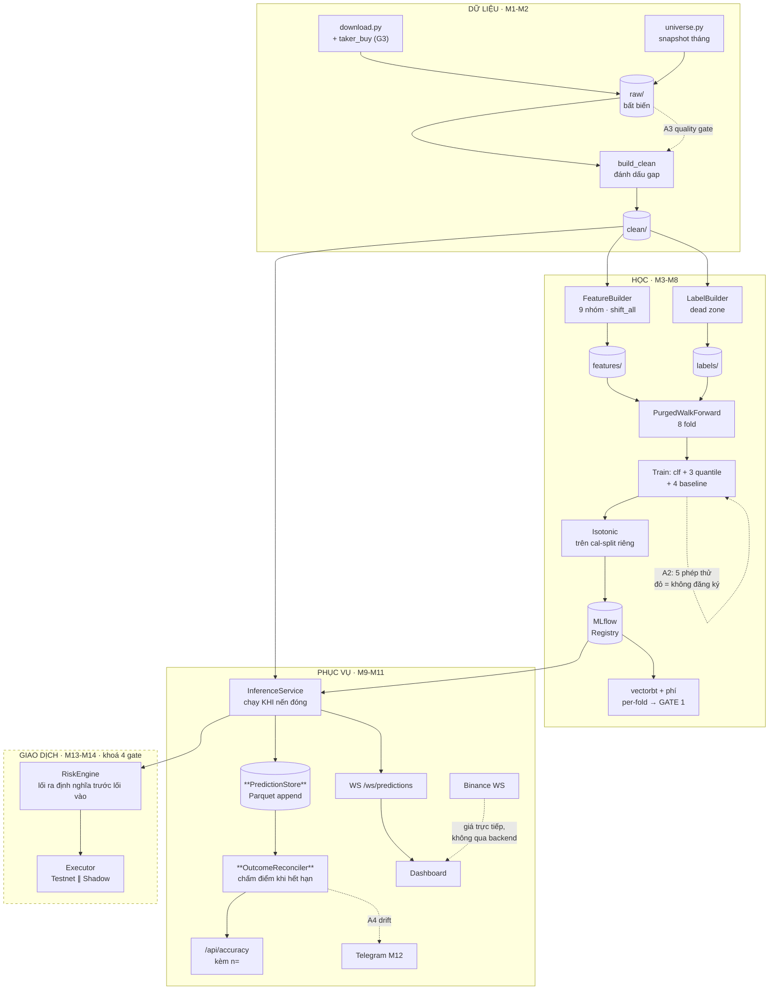

# CHIẾN LƯỢC THỰC THI — TỪ BẢN THIẾT KẾ TỚI HỆ THỐNG CHẠY ĐƯỢC

> Phiên bản 1.0 · 24/08/2026 · Sinh từ phân tích toàn bộ `docs/00–03`
> Vai trò: `00_MASTER_PLAN` là **hiến pháp** (what/why). Tài liệu này là **kế hoạch tác chiến** (how/when/who) — harness cụ thể, chế độ audit, detail design, và WBS đã xếp ưu tiên.

---

## 1. PHÂN TÍCH BỘ TÀI LIỆU — 7 KHOẢNG TRỐNG PHẢI LẤP

Bộ docs 00–03 mạnh ở chỗ hiếm dự án cá nhân nào có: scope đã chốt, 12 luật chống tự lừa, DoD đo được cho từng module, design token đã kiểm định mù màu. Phân tích chéo 4 tài liệu tìm ra **7 khoảng trống** — mỗi cái kèm quyết định đề xuất để không chặn tiến độ:

| # | Khoảng trống | Ở đâu | Quyết định đề xuất |
|---|---|---|---|
| **G1** | M10 nói "mọi dự đoán ghi vào DB kèm timestamp" nhưng **không tài liệu nào chỉ định DB** | 03 §M10 | Parquet append + DuckDB view — đúng stack sẵn có, không thêm hạ tầng. → ADR-002 |
| **G2** | `GET /api/accuracy` cần **kết quả thực tế** của dự đoán cũ, nhưng không module nào chủ quản việc đối chiếu dự đoán ↔ thực tế | 03 §M9 | Thêm **OutcomeReconciler** vào M10: job chạy sau mỗi nến đóng, chấm điểm các dự đoán đã hết hạn. → §6.8 |
| **G3** | Feature `taker_buy_ratio` (03 §M3 gọi là "bị đánh giá thấp") **không có trong `fetch_ohlcv` của ccxt** | 04 §4.3 vs thực tế API | Gọi thẳng `/api/v3/klines` (cột 9) — thêm cột vào M1 khi tải mẻ lớn, để M3 không phải tải lại lần hai. → WBS-2 |
| **G4** | Ngưỡng thanh khoản 5M USD/30 ngày **gần như không lọc**: thực đo 24/08 cho 422/474 cặp lọt qua | 00 §4.2 | Chờ bạn chốt: giữ nguyên (dựa vào top-40) hay siết thành 150M (≈5M/ngày). Không chặn — top-40 vẫn đúng. |
| **G5** | "Tính chỉ báo lại trong từng fold" (03 §M3) hiểu máy móc sẽ tốn **×8 lần tính toán** | 03 §M3 | Chỉ báo *causal* (chỉ nhìn lùi) cho kết quả **giống hệt** dù tính một lần trên cả chuỗi — thứ phải per-fold là **chuẩn hoá (fit z-score)** và **cắt warm-up**. Bộ leakage test A2 là trọng tài chứng minh tương đương. → ADR-003 |
| **G6** | 00 §0 nói "2 model riêng", 03 §M4 nói 3 horizon (1h/4h/1d) | 00 vs 03 | 1 pipeline duy nhất, **3 model theo timeframe**, khác nhau chỉ ở config. "2" của §0 là intraday-vs-daily về *tư duy*, không phải số artifact. → ADR-004 |
| **G7** | `expected_vol_pct`: "GARCH đơn giản **hoặc** realized vol" — chưa chốt | 00 §5 | EWMA realized vol trước (5 dòng code, đủ cho position sizing). GARCH là nâng cấp sau GATE 1, không phải điều kiện. → ADR-004 |

**Kết luận phân tích:** không có mâu thuẫn chết người nào — bộ docs nhất quán về triết lý. Cái thiếu là *lớp giữa*: các quyết định kỹ thuật nhỏ (G1–G7) và cơ chế cưỡng chế luật. Tài liệu này lấp đúng lớp đó.

---

## 2. CHIẾN LƯỢC TỔNG THỂ — 4 NGUYÊN TẮC ĐIỀU HÀNH

### S1 — Trọng tài trước cầu thủ
Bộ kiểm định (M6) phải chạy được **trước khi** model đầu tiên ra số. 00 §10 đã nói M3+M6 song song; chiến lược này đi xa hơn: **splitter của M6 xong trước khi M3 hoàn tất** (WBS-3 trước WBS-5), vì mọi quyết định chuẩn hoá của M3 phụ thuộc vào ranh giới fold.

### S2 — Luật nào có thể bị quên lúc 11 giờ đêm thì chuyển thành hook
CLAUDE.md là *lời khuyên*; hook là *luật* (01 §13). Trong 12 RULE, có 4 luật cưỡng chế được bằng máy: RULE 2 (shift — test), RULE 3 (fold boundaries — test), RULE 5 (phí trong config — test), RULE 9 (chặn lệnh live — PreToolUse hook). Làm ngay ở WBS-0 vì chi phí nửa ngày mà bảo vệ mọi thứ phía sau.

### S3 — Mỗi module một vòng: Plan → Build → Audit đối kháng → Gate
1. **Plan Mode** trước khi viết dòng code nào (01 §11).
2. Build theo detail design ở §6.
3. **Subagent đối kháng** soi kết quả — prompt "hãy chứng minh nó sai", không phải "kiểm tra giúp" (03 §M4 gọi đây là kỹ thuật đáng giá nhất dự án).
4. Tick đủ DoD trong 03 → cập nhật bảng trạng thái CLAUDE.md → mới sang module sau.

### S4 — Trì hoãn mọi quyết định đắt còn trì hoãn được
| Quyết định | Trì hoãn tới | Vì sao |
|---|---|---|
| MCP server riêng cho Binance | M9 | Trước đó chưa có API để bọc; làm sớm là bọc thứ chưa tồn tại |
| Localhost → VPS | Sau GATE 1 | Model chưa thắng baseline thì deploy là trang trí |
| APScheduler → Prefect | Khi retry/observability thành đau thật | 00 §3.1 đã nói vậy |
| GARCH | Sau GATE 1 | G7 |
| CatBoost đối chiếu | Sau khi LightGBM có điểm chuẩn | So sánh cần mốc trước |

**Nhịp tuần (10h):** 6h build theo WBS · 2h chạy audit + đọc kết quả · 1h cập nhật docs/ADR/CLAUDE.md · 1h dự phòng (thực tế luôn dùng hết).

---

## 3. HARNESS MAP — DÙNG GÌ, Ở ĐÂU, KHI NÀO

Nguyên tắc chọn: mỗi tính năng Claude gắn với **một file cụ thể trong repo** và **một module kích hoạt**. Không dùng tính năng nào chỉ vì nó hay.

### 3.1 Hooks — `.claude/settings.json` + `.claude/hooks/*.sh`

| ID | Sự kiện | Làm gì | Khi dựng |
|---|---|---|---|
| **H1** | `PreToolUse` Bash | `block_live_trading.sh` — chặn mọi lệnh khớp `api/v3/order`, `create_order`, `--live` khi `TRADING_ENABLED≠true`. Exit 2 + thông điệp cho Claude. Cưỡng chế RULE 9 ở tầng máy. | **WBS-0, ngay** |
| **H2** | `PreToolUse` Bash | `protect_raw.sh` — chặn `rm/mv/sed/>` nhắm vào `data/raw/` (raw là bất biến, chỉ downloader được ghi) | **WBS-0** |
| **H3** | `PostToolUse` Edit\|Write `*.py` | `ruff format` + `ruff check --fix` file vừa sửa | **WBS-0** |
| **H4** | `PostToolUse` Edit\|Write `src/cryptopred/validation/**` | Tự chạy `pytest -m leakage` ngay sau khi sửa module kiểm định — sửa trọng tài thì trọng tài phải tự kiểm tra mình | M6 |
| **H5** | git `pre-commit` (hook git, không phải hook Claude) | `make test-leakage` — đỏ là không commit được, kể cả commit bằng tay ngoài Claude | M6 |

### 3.2 Skills — `.claude/skills/<tên>/SKILL.md`

| Skill | Kích hoạt khi | Nội dung lõi | Khi dựng |
|---|---|---|---|
| `ai-coding` | Mọi yêu cầu viết/sửa/refactor code trong repo | Quy trình 6 bước: đọc trạng thái → theo detail design → luật theo thư mục → quy ước → vòng kiểm chứng (test/lint chưa xanh chưa báo xong) → khép vòng (CLAUDE.md/ADR). Khi nào dừng và hỏi. | **✅ đã dựng** (`.claude/skills/ai-coding/`) |
| `visualize-dashboard` | "dashboard", "chart", "biểu đồ", "component UI", sửa `web/` | 8 luật DS rút gọn thao tác + cấu tạo chart bắt buộc + 14 component + checklist tiếp cận; luôn nạp kèm `dataviz`; màu chỉ từ tokens.css | **✅ đã dựng** (`.claude/skills/visualize-dashboard/`) |
| `feature-guardrails` | Nhắc tới "thêm feature", "chỉ báo", "indicator" | RULE 1 + RULE 2 + 3 cạm bẫy (center=True, bfill, warm-up per-fold) + checklist: kết thúc hàm phải là `shift_all` → `assert_scale_free` | **M3, trước khi viết feature đầu tiên** |
| `leakage-audit` | "audit", "rò rỉ", "accuracy cao bất thường", accuracy >60% | Runbook 5 phép thử M6 theo đúng thứ tự + cách đọc kết quả từng phép | M6 |
| `backtest-report` | "backtest", "đánh giá model", "tearsheet" | Cấu hình phí bắt buộc + mẫu báo cáo per-fold + ngưỡng GATE 1 + câu cảnh báo bắt buộc khi Sharpe >3 | M8 |

Viết `description` như quảng cáo cho Claude (01 §7): ngôi thứ ba, nhồi từ khoá kích hoạt.

### 3.3 Subagents — `.claude/agents/<tên>.md`

| Agent | Tools | Vai trò | Khi dựng |
|---|---|---|---|
| `leakage-hunter` | Read, Grep, Glob (read-only) | Soi từng feature: "tại t, có dùng thông tin index ≥ t không?" Trả bảng feature\|file:dòng\|rủi ro\|lý do. **Không sửa code, chỉ báo cáo.** Mẫu có sẵn trong 01 §10. | M3 |
| `label-adversary` | Read, Grep, Bash (chạy test) | Nhiệm vụ duy nhất: **chứng minh bộ nhãn bị rò rỉ**. Prompt đối kháng, không phải xác nhận. | M4 |
| `risk-reviewer` | Read, Grep | Review code động tới tiền với vai kỹ sư hoài nghi: soi race condition, trạng thái sau restart, đường đi của kill switch | M13 |

Dùng subagent khi output rác nhiều mà kết quả gói trong một bảng (quét 40 file, chạy 200 test, backtest song song nhiều khung ở M8). Không dùng cho việc cần trao đổi qua lại.

### 3.4 Các harness còn lại

| Harness | Dùng cho | Ghi chú |
|---|---|---|
| **Plan Mode** | Đầu mỗi module, bắt buộc theo S3 | So kế hoạch với detail design §6 trước khi duyệt |
| **Slash command** `/train <symbol> <tf>` | M5 — chạy pipeline + in bảng so baseline | Đặt tại `.claude/commands/train.md` |
| **MCP server** `cryptopred-mcp` | M9 — bọc `/api/prediction`, mọi phiên Claude sau hỏi được "BTC 4h đang dự đoán gì?" | **Không làm trước M9** (S4). Trả lời câu hỏi mở §10 của 00: có, nhưng đúng thời điểm |
| **Scheduled task (desktop)** | M12 — retrain đêm + báo cáo sáng | Chọn desktop vì cần file local (01 §14). ⚠️ Trạng thái xanh ≠ thành công — prompt phải tự định nghĩa "thành công là gì" và ghi heartbeat file để A5 giám sát |
| **Claude in Chrome** | M11 — mở dashboard, chụp màn hình, đọc console tự tìm lỗi UI | |
| **Artifacts** | M2 (sơ đồ 4 tầng dữ liệu), M11 (prototype dashboard trước khi code thật) | |
| **Memory vs ADR** | Phân công rõ: quyết định kiến trúc → `docs/adr/` (đi theo repo, mọi phiên đọc được); sở thích cá nhân của bạn → memory | Không để quyết định nào chỉ sống trong hội thoại |

---

## 4. CHẾ ĐỘ AUDIT LIÊN TỤC — GIỮ HỆ THỐNG KHÔNG NHIỄU

"Nhiễu" trong dự án này có **4 mặt**, mỗi mặt cần cơ chế riêng:

1. **Rò rỉ** (leakage) — model nhìn thấy tương lai → điểm đẹp giả.
2. **Trôi dữ liệu** (data drift) — sàn sửa nến cũ, lỗ hổng mới, coin bị huỷ niêm yết.
3. **Trôi hiệu chỉnh** (calibration drift) — "62%" hôm nay không còn nghĩa 62% sau 3 tháng.
4. **Trôi ngữ cảnh** (context drift) — các phiên Claude sau hiểu sai hiện trạng vì docs không theo kịp code.

### Sáu tầng audit — tầng nào đỏ thì tầng sau không có ý nghĩa

| Tầng | Chống | Kích hoạt | Công cụ | Hành động khi đỏ |
|---|---|---|---|---|
| **A0** Lint/format | lỗi cú pháp, style trôi | mỗi lần sửa file | Hook H3 (ruff) | Tự sửa tại chỗ |
| **A1** Guardrail | RULE 1, RULE 2 bị lách | mỗi commit | Hook H5 → `make test-leakage` | **Chặn commit.** Không có "commit tạm rồi sửa sau" |
| **A2** 5 phép thử thống kê | rò rỉ tinh vi (nhãn, fold, tương quan) | **mỗi lần train**, trước khi đăng ký model | Bước bắt buộc trong pipeline M5: đỏ → MLflow ghi run kèm tag `leakage=FAIL`, **từ chối đăng ký model** | Truy vết theo runbook `leakage-audit`, không train tiếp |
| **A3** Chất lượng dữ liệu | trôi dữ liệu | mỗi lần download + snapshot universe hằng tháng | `quality_report` có ngưỡng (lỗ hổng mới >0 → WARN; giá ≤0, high<low → FAIL) + diff universe tháng này vs trước | FAIL → không build clean; coin rời universe → ghi log cho backtest |
| **A4** Trôi hiệu chỉnh | calibration drift | hằng tuần (scheduled task từ M12) | Rolling Brier 30 ngày so với Brier lúc đăng ký model; reliability re-check trên dữ liệu mới | Lệch >20% → cờ "cần retrain" + Telegram; dashboard hạ `confidence_band` |
| **A5** Live vs backtest | tự lừa ở khâu cuối | hằng ngày trong giai đoạn shadow (M14) | Tracking error PnL shadow vs backtest cùng kỳ | Lệch ngoài ±30% (GATE 3) → **vấn đề ở backtest, không phải thị trường** — quay lại M8 |
| **A6** Vệ sinh ngữ cảnh | context drift | cuối mỗi module (checklist S3) | Cập nhật bảng trạng thái CLAUDE.md; quyết định mới → ADR; quy trình lặp ≥3 lần → skill | Phiên Claude mới trả lời sai "dự án đang ở đâu" = A6 đang đỏ |

**Nguyên tắc chung:** audit không bao giờ im lặng. Mọi kết quả ghi vào `reports/` (gitignored) + MLflow; từ M12 thêm kênh Telegram. Chế độ hỏng nguy hiểm nhất của audit — giống RULE 8 của dashboard — là *không chạy mà không ai biết*: vì vậy báo cáo sáng của M12 phải in cả dòng "audit A3/A4 lần cuối chạy lúc nào".

---

## 5. SYSTEM DESIGN — KIẾN TRÚC TINH CHỈNH

Giữ nguyên khung 00 §2, **thêm 3 mảnh còn thiếu** (in đậm): PredictionStore, OutcomeReconciler, và luồng audit.



### 5.1 Hợp đồng dữ liệu giữa các tầng

| Frame | Cột | Bất biến (được test) |
|---|---|---|
| **OHLCV raw** | index `ts` UTC · o/h/l/c/v · `taker_buy_volume` (sau G3) | monotonic, unique, chỉ nến đã đóng |
| **Clean** | raw + `gap_before: bool` + `n_missing_before: int` | không điền giá; chỉ đánh dấu |
| **Feature matrix** | ~45 cột scale-free, tên theo quy ước §6.3 | không cột nào ∈ {o,h,l,c,v}; đã shift ≥1; không NaN sau warm-up |
| **Label frame** | `r_future`, `theta`, `label ∈ {-1,0,+1}` | H hàng cuối NaN; nhãn t chỉ phụ thuộc dữ liệu >t |
| **Fold** | `train_idx`, `test_idx`, 3 mốc thời gian | `train_end + purge ≤ test_start`; embargo sau test |
| **Prediction** | schema 00 §5 (đã có `serving/schemas.py`) | chỉ `p_up_calibrated` được hiển thị |
| **PredictionRecord** | Prediction + `outcome: float?` + `hit: bool?` + `scored_at` | dedupe theo (symbol, tf, predicted_at) |

### 5.2 ADR cần viết (theo mẫu `docs/adr/000`)

ADR-002 PredictionStore = Parquet+DuckDB (G1) · ADR-003 chiến lược tính feature per-fold (G5) · ADR-004 ba model theo timeframe + EWMA vol (G6, G7) · ADR-005 purge/embargo = horizon nhãn (đã hứa ở 03 §M6 DoD).

---

## 6. DETAIL DESIGN TỪNG MODULE

Sâu cho M2–M8 (6 tuần tới), phác cho M9+ (chi tiết hoá khi tới phase, tránh thiết kế thứ sẽ đổi).

### 6.1 M2 · `store.build_clean` — thuật toán 5 bước

1. Đọc raw → `_tidy` (đã có: dedupe giữ bản mới, sort).
2. Validate cứng: giá ≤0, high<low, volume âm → **FAIL toàn file** (dữ liệu sàn không được phép sai kiểu này; sai là lỗi tải).
3. Validate mềm: nhảy giá >50%/nến → giữ nguyên + ghi `anomaly: true` (có thể thật — LUNA đã từng).
4. Đánh dấu lỗ hổng: `gap_before = (Δt > step)`, `n_missing_before = Δt/step − 1`. **Không điền.**
5. Ghi `clean/` cùng bố cục phân vùng; in báo cáo A3.

DoD giữ nguyên 03: truy vấn 1 năm 1h < 200ms (DuckDB đọc thẳng Parquet — đạt sẵn).

### 6.2 M3 · Cấu trúc package feature

```
features/
├── builder.py        # orchestrator: build_features(ohlcv, btc, cfg)
├── registry.py       # REGISTRY: dict[str, GroupFn] — mỗi nhóm tự đăng ký
└── groups/
    ├── returns.py    volatility.py    momentum.py    trend.py
    ├── volume.py     candle.py        time_of_day.py
    ├── cross_market.py   # ★ nhận thêm btc frame, căn timestamp bằng reindex trái
    └── regime.py
```

**Hợp đồng một nhóm:** `fn(ohlcv: DataFrame, ctx: FeatureContext) -> DataFrame` — trả về cột scale-free, **chưa shift** (shift là việc của orchestrator, một chỗ duy nhất). Orchestrator kết thúc bắt buộc:

```python
out = pd.concat(parts, axis=1)
out = shift_all(out)          # RULE 2 — điểm nghẽn duy nhất
assert_scale_free(out)        # RULE 1
return out
```

**Quy ước tên cột** (máy đọc được, dùng cho audit A2): `ret_1, ret_72` · `vol_rv24, vol_atr14, vol_park24` · `mom_rsi14, mom_macdh_atr` · `trend_c_ema20` · `volm_z96, volm_taker` · `cndl_range, cndl_pos` · `time_hour_sin` · `x_btc_ret1, x_excess1, x_beta30` · `rgm_volp30`.

**Chính sách NaN:** warm-up (EMA200 → 200 nến đầu) để NaN, cắt ở tầng train theo fold; `ffill` chỉ cho cross-market khi BTC thiếu nến mà coin có; **bfill và interpolate bị test cấm**.

**Cross-market — nơi dễ rò rỉ nhất:** căn `btc.reindex(coin.index, method="ffill")` (chỉ kéo quá khứ BTC về, không bao giờ tương lai) rồi mới tính. `leakage-hunter` soi riêng file này mỗi lần sửa.

### 6.3 M4 · Nhãn — 2 chi tiết 03 chưa nói

- **Sàn cho theta:** `theta = max(0.3·rolling_std(ret,96), 5bp)` — thị trường chết (std→0) sẽ biến nhiễu 1 tick thành "TĂNG" nếu không có sàn.
- Bố cục ghi: `labels/horizon=<tf>/symbol=*/year=*` — 3 horizon theo G6.
- Test bắt buộc: H hàng cuối NaN; đảo ngược chuỗi giá thì nhãn phải đảo tương ứng (sanity đối xứng).

### 6.4 M6 · PurgedWalkForward — toán chỉ số chính xác

```
n = len(index); test_len = (n − min_train) // n_folds
fold k (0-based):
  test  = [min_train + k·test_len, min_train + (k+1)·test_len)
  train = [0, test_start − purge)                      # purge cắt TRƯỚC test
  fold sau chỉ được nhận thêm dữ liệu từ test_end + embargo trở đi
```

Bất biến được test: (i) `train_end + purge ≤ test_start` mọi fold; (ii) hợp các test không giao nhau; (iii) tổng thời gian test ≥ 24 tháng khi n_folds=8 trên 3 năm dữ liệu (GATE 1).

**Bộ dò rò rỉ — API thống nhất:** mỗi phép thử trả `ProbeResult(name, passed, score, threshold, details)`; runner `run_all_probes(features, labels, splitter)` dùng **proxy model rẻ** (LightGBM 50 cây hoặc logistic) — mục tiêu là phát hiện rò rỉ, không phải điểm cao, nên phải nhanh (<60s) để nằm được trong A2 mỗi lần train.

### 6.5 M5 · Train — 6 bước và quy ước MLflow

Baselines → A2 probes (đỏ = dừng) → classifier per-fold → 3 quantile → gộp OOS predictions → so baseline sau phí. MLflow: experiment `cryptopred-<tf>`; tags bắt buộc `git_hash, seed, data_hash, universe_month, leakage=PASS/FAIL`; metrics per-fold `fold{k}/auc`, tổng `oos/sharpe_after_costs`. Run thiếu tag = vi phạm RULE 10, script train tự từ chối chạy nếu working tree bẩn (git hash phải trỏ đúng code).

### 6.6 M7 · Calibration — chia trong fold

Trong mỗi fold train: 80% đầu (theo thời gian) fit model, 20% cuối fit isotonic. **Không bao giờ** chạm tập test của fold. Reliability diagram vẽ trên OOS gộp, theo chuẩn dataviz skill: đường chéo tham chiếu, CI, n mỗi bin ≥50.

### 6.7 M8 · Backtest — mapping tín hiệu

`p_up_cal > 0.58 → long | < 0.42 → short (spot: flat) | còn lại → flat`. vectorbt: `fees=0.001, slippage=0.0005`, khớp ở **open nến t+1** (tín hiệu tính xong tại close t — khớp cùng close t là một dạng lookahead). Báo cáo: bảng per-fold + phân phối, không chỉ trung bình; tự động so 4 baseline; chấm GATE 1 rõ ràng đạt/trượt và **ghi lại cả khi trượt**.

### 6.8 M9–M10 · Serving (phác)

- **Candle-close detector:** nguồn chính là WS kline Binance với cờ `k.x=true` (nến đóng); fallback REST poll tại `close+5s` nếu WS im — hai nguồn vì detector chết lặng lẽ là nguồn "Dự đoán cũ" số một.
- **PredictionStore:** append `data/predictions/<tf>/year=*/predictions.parquet`, dedupe (symbol, tf, predicted_at) — chạy lại không ghi trùng, giống hệt triết lý M1.
- **OutcomeReconciler (G2):** mỗi nến đóng, tìm prediction có `valid_until ≤ now` chưa chấm → điền `outcome = log(close_now/last_close)`, `hit = sign khớp direction` → nguồn duy nhất cho `/api/accuracy` và audit A4.
- **Endpoint bổ sung theo 05 §3.5:** `GET /api/predictions/history?symbol=&timeframe=&limit=` — nguồn cho dải tín hiệu quá khứ trên chart.
- Stale rule (RULE 8): `now > valid_until` mà chưa có bản mới → WS đẩy sự kiện `stale`, dashboard đổi trạng thái — backend chủ động nói, không để frontend tự đoán.

### 6.9 M11–M14 (phác — 03 đã specc kỹ)

M11: 3 file luồng (`priceStream/predictionStream/history.js`) + build components theo đúng bảng 14 mục của 02 §4, thứ tự: AppShell → PriceChart → PredictionCard → FreshnessIndicator trước, phần còn lại sau. M12: chỉ báo khi **hướng đổi**, rate-limit N tin/giờ, dedupe qua restart bằng PredictionStore. M13 **trước** M14, nhóm 3 (lối ra: stop 1.5×ATR đặt cùng lệnh vào, max-hold hết horizon, KHÔNG RÕ = đóng vị thế) viết trước nhóm 1–2. M14: Testnet chứng minh đường ống ∥ Shadow-mainnet chứng minh kinh tế — **không chấm PnL trên Testnet**.

---

## 7. WBS ƯU TIÊN

**Ba tiêu chí xếp hạng:** (1) thứ *bắt nói dối* đứng trước thứ *sinh con số* · (2) harness rẻ mà bảo vệ dài hạn — làm ngay · (3) trên đường găng thì ưu tiên, không thì trì hoãn.

| ID | Việc | Module | Ước lượng | Phụ thuộc | Ưu tiên | Nghiệm thu |
|---|---|---|---|---|---|---|
| **W0** | Hooks H1–H3 + agent `leakage-hunter` + skill `feature-guardrails` (skill `ai-coding` ✅ đã dựng) | Harness | 0.5d | — | **P0 · ngay** | Thử gõ lệnh chứa `create_order` → bị chặn kèm thông điệp |
| **W1** | Batch download 3 năm × 40 cặp × 3 khung + cột taker_buy (G3) + listing dates | M1 | 0.5d + chạy nền | — | **P0** | `make check-data` đủ 40×3; chạy lại +0 nến |
| **W2** | `build_clean` + quality gate A3 | M2 | 2d | W1 | **P0** | DoD 03 §M2; báo cáo A3 in cho cả 40 cặp |
| **W3** | **PurgedWalkForward + test ranh giới** + ADR-005 | M6a | 2d | — (song song W1–W2) | **P0** | 3 bất biến §6.4 xanh; vẽ được sơ đồ fold trên dữ liệu thật |
| **W4** | Feature nhóm nội-coin (returns/vol/momentum/trend/candle/time) | M3a | 2d | W2, skill W0 | **P0** | ~30 cột đúng quy ước tên; guardrail test xanh |
| **W5** | Cross-market + regime + volume (dùng taker từ W1) | M3b | 1.5d | W4 | **P0** | `leakage-hunter` quét sạch; căn timestamp có test |
| **W6** | Nhãn 3 horizon + sàn theta + `label-adversary` audit | M4 | 1d | W2 | **P0** | Phân bố ≤60/40; adversary không tìm được rò rỉ |
| **W7** | 5 phép thử leakage (bỏ 5 skip trong `test_leakage.py`) + hook H4, H5 | M6b | 2d | W3–W6 | **P0** | Cả 5 chạy <60s; commit với test đỏ bị chặn thật |
| **W8** | 4 baseline + MLflow setup + quy ước tag | M5a | 1d | W6, W3 | **P1** | RULE 4: 3 baseline có điểm trong MLflow |
| **W9** | LightGBM clf + 3 quantile, train per-fold, A2 gắn vào pipeline | M5b | 2d | W7, W8 | **P1** | Chạy hết 8 fold; nếu acc>60% → quy trình RULE 11 tự kích hoạt |
| **W10** | Isotonic + reliability diagram + `/train` slash command | M7 | 1.5d | W9 | **P1** | GATE 2 chấm được (đạt hay không đều ghi lại) |
| **W11** | vectorbt + tearsheet per-fold + chấm GATE 1 + skill `backtest-report` | M8 | 3d | W10 | **P1** | GATE 1 đạt/trượt rõ ràng — **trượt cũng là kết quả hợp lệ** |
| **W12** | FastAPI 6 endpoint + test | M9 | 2d | W11 | **P2** | DoD 03 §M9 |
| **W13** | InferenceService + PredictionStore + **OutcomeReconciler** (G1, G2) | M10 | 2d | W12 | **P2** | 48h không sập; accuracy có n= |
| **W14** | MCP `cryptopred-mcp` bọc /api/prediction | M9+ | 0.5d | W12 | **P2** | Hỏi "BTC 4h?" trong phiên Claude mới → có câu trả lời |
| **W15** | Dashboard M11 — **tách W15a/b/c theo `05_DASHBOARD_UX_PLAN.md §6`** (✅ prototype v2: timestamp thật, thanh khung Binance, track record) | M11 | 5.5d | W13 | **P2** | Checklist 02 §6 + DoD từng gói trong 05 §6 |
| **W16** | Telegram + scheduled task đêm/sáng + audit A4 | M12 | 1d | W13 | **P2** | Nhận tin trên điện thoại; không trùng sau restart |
| **W17** | RiskEngine — nhóm 3 lối ra trước, mỗi giới hạn một test cố tình vi phạm | M13 | 3d | W11 (GATE 1) | **P3** | DoD 03 §M13 + `risk-reviewer` duyệt PR |
| **W18** | Executor: Testnet ∥ Shadow-mainnet, audit A5 hằng ngày | M14 | 3d + 60 ngày | W17, GATE 1+2 | **P3** | GATE 3: ≥100 lệnh, 0 sự cố, ±30% |

**Đường găng:** W1 → W2 → W4 → W5/W6 → W7 → W9 → W10 → W11 (GATE 1) — mọi thứ sau GATE 1 đều có thể chờ. W3 chạy song song ngay từ đầu và **phải xong trước W7**.

**Map vào roadmap 12 tuần của 00 §6:** W0–W2 = tuần 2 · W3–W6 = tuần 3–4 · W7–W8 = tuần 5 · W9–W10 = tuần 6–7 · W11 = tuần 8–9 (00 đã nói thẳng: đây là nơi phần lớn dự án chết, và trượt GATE 1 lần đầu là *nhìn thấy sự thật*, không phải thất bại) · W12–W16 = tuần 10–12 · W17–W18 = tuần 13+.

### Ba quyết định đang chờ bạn (không chặn W0–W3)

1. **G4** — ngưỡng thanh khoản: giữ 5M/30 ngày (lọc hình thức, dựa vào top-40) hay siết 150M?
2. **Số coin tải ở W1** — 40 cặp theo config, hay 45–50 để dư cho coin rơi khỏi universe giữa chừng?
3. **GATE 1 trượt thì làm gì trước** — quay lại thêm feature (M3) hay đổi nhãn (M4)? Nên quyết trước bằng đầu lạnh, đúng tinh thần RULE 9.

---

## 8. VIỆC NGAY TUẦN NÀY

```text
□ W0 — dựng hooks + agent + skill        (0.5 ngày, bảo vệ mọi thứ sau)
□ W1 — bấm nút tải mẻ lớn, chạy nền      (0.5 ngày canh máy)
□ W3 — bắt đầu PurgedWalkForward          (trọng tài trước cầu thủ — S1)
□ Trả lời 3 quyết định ở §7 khi tiện
```

---

*Tài liệu liên quan: `00_MASTER_PLAN.md` (hiến pháp) · `03_MODULE_SPECS.md` (DoD từng module) · `docs/adr/` (quyết định) · CLAUDE.md (trạng thái sống)*
