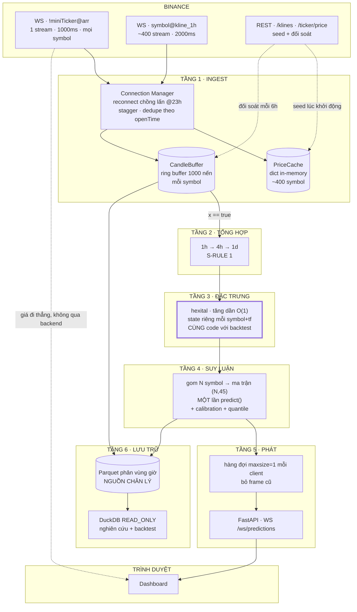

# KIẾN TRÚC STREAMING & DỰ ĐOÁN LIÊN TỤC

> Phiên bản 1.0 · 25/08/2026 · Bổ sung chi tiết cho `00_MASTER_PLAN.md` §2
> Mọi giới hạn API trong tài liệu này được kiểm chứng trực tiếp từ tài liệu Binance tháng 8/2026, không lấy từ trí nhớ.

---

## 0. BÀI TOÁN THẬT, BẰNG SỐ

Trước khi chọn công nghệ, phải biết tải thật là bao nhiêu. Rất nhiều thiết kế streaming sai ngay ở bước này — người ta dựng Kafka cho một khối lượng công việc mà `asyncio` xử lý xong trong 21 mili giây.

| Đại lượng | Con số |
|---|---|
| Số cặp USDT spot đang hoạt động | ~400 (trên tổng ~1.400 symbol) |
| Khung thời gian cần dự đoán | 3 (1h · 4h · 1d) |
| Stream kline nếu làm ngây thơ | 400 × 3 = **1.200** |
| Giới hạn stream mỗi kết nối của Binance | **1.024** ← vượt |
| Số feature mỗi lần dự đoán | ~45 |
| Thời gian LightGBM predict một dòng | **~52 µs** |
| **Tổng thời gian tính toán ở đỉnh tải** | 400 × 52µs ≈ **21 ms**, một lần mỗi giờ |

**Kết luận quan trọng nhất của tài liệu này:** khối lượng tính toán là *rất nhỏ*. Toàn bộ đỉnh tải một giờ gói gọn trong 21 mili giây. Vấn đề kỹ thuật thật của hệ thống này **không phải throughput** — mà là **độ bền của kết nối** và **tính đúng đắn của đặc trưng**. Mọi quyết định bên dưới đều xoay quanh hai điều đó.

---

## 1. MƯỜI LUẬT STREAMING

### S-RULE 1 — Chỉ subscribe `kline_1h`, tự tổng hợp 4h và 1d

**Luật:** Không bao giờ subscribe cả ba khung. Chỉ lấy `<symbol>@kline_1h`, rồi tự dựng nến 4h từ 4 nến 1h và nến 1d từ 24 nến 1h.

**Tại sao:** Nến 4h luôn đóng đúng vào một thời điểm mà nến 1h cũng đóng (00:00, 04:00, 08:00… UTC). Nến 1d cũng vậy. Nghĩa là **thông tin đóng nến 4h và 1d đã nằm sẵn trong luồng 1h** — subscribe thêm chỉ là nhận lại cùng một sự thật ba lần.

**Được gì:** 1.200 stream tụt xuống **400** — nằm gọn dưới giới hạn 1.024, chỉ cần **một kết nối** thay vì hai, và loại bỏ hẳn một lớp lỗi (ba nguồn cùng mô tả một sự kiện thì sớm muộn cũng lệch nhau).

**Biên thời gian đã kiểm chứng:** `timeZone` mặc định của Binance là 0 (UTC), nến 1d mở đúng 00:00 UTC, và 24 nến 1h ghép khít vào nó. Nến 4h mở tại 00, 04, 08, 12, 16, 20 UTC.

**Công thức tổng hợp — kèm kiểm tra đầy đủ, phần bắt buộc:**
```python
def aggregate(bars_1h, expected_count):          # 4 cho 4h, 24 cho 1d
    if len(bars_1h) != expected_count:
        return Candle(..., incomplete=True)      # KHÔNG được đưa vào predict
    if not is_contiguous(bars_1h):               # openTime cách đều 3_600_000 ms
        return Candle(..., incomplete=True)
    return Candle(
        open   = bars_1h[0].open,
        high   = max(b.high for b in bars_1h),
        low    = min(b.low  for b in bars_1h),
        close  = bars_1h[-1].close,
        volume = sum(b.volume for b in bars_1h),
        incomplete = False,
    )
```

⚠️ **Không có hai dòng kiểm tra trên, nến 4h dựng từ 3 nến sẽ trông hoàn toàn bình thường.** Không exception, không log, chỉ là một nến sai đi thẳng vào model — và sau này vào cả stop-loss theo ATR. Bốn tình huống tạo ra thiếu nến: sàn bảo trì, coin mới niêm yết, tiến trình restart giữa cửa sổ, và **Binance sinh nến rỗng (volume 0) trễ tới ~10 giây** sau biên chứ không phải ≤2 giây.

**Xử lý khi thiếu:** chờ thêm 15 giây; vẫn thiếu thì REST `/klines` lấy bù; vẫn thiếu thì gắn cờ `incomplete=True` và **bỏ qua chu kỳ dự đoán này cho symbol đó**, có ghi log.

**Bắt buộc có test:** so nến 4h tự dựng với nến 4h Binance qua REST trên 1.000 mốc — và tập test **phải bao gồm ít nhất một coin thanh khoản thấp và một phiên bảo trì của sàn**, không chỉ BTC. Test chỉ chạy trên BTC sẽ xanh trong khi logic vẫn sai.

---

### S-RULE 2 — Đặc trưng phải chạy CÙNG một đoạn code ở backtest và ở live ★

**Luật:** Chỉ tồn tại **một** cài đặt cho mỗi chỉ báo. Backtest gọi nó, hệ thống live gọi nó. Không có bản "nhanh cho live" và bản "tiện cho nghiên cứu".

**Tại sao — đây là luật quan trọng nhất trong tài liệu:** Nếu bạn train trên `pandas-ta` rồi phục vụ bằng thư viện tăng dần, model sẽ nhìn thấy một **phân phối hơi khác** so với lúc học. Hiện tượng này gọi là *train/serve skew*, và nó giết mô hình một cách âm thầm — không có exception, không có log lỗi, chỉ có hiệu suất live tệ hơn backtest mà bạn không hiểu vì sao.

**Ba cái bẫy cụ thể:**

1. **`pandas.ewm(adjust=True)` — mặc định — KHÔNG phải công thức EMA đệ quy.** Nó là trung bình có trọng số chuẩn hoá mở rộng. Nó hội tụ về `adjust=False` nhưng khác nhau rõ rệt trong giai đoạn khởi động. `pandas-ta` và thư viện tăng dần sẽ bất đồng ở những nến đầu.
2. **Chỉ báo làm mượt kiểu Wilder (RSI, ATR, ADX) có bộ nhớ vô hạn.** Một RSI khởi động từ nến 500 **không bao giờ** bằng chính xác một RSI tính từ nến 0. Chênh lệch giảm theo cấp số nhân nhưng không bao giờ về 0.
3. Vì lý do trên, phải **làm ấm mỗi chỉ báo tối thiểu 5 lần chu kỳ dài nhất** trước khi tin giá trị của nó. Với EMA200 nghĩa là 1.000 nến.

**Bắt buộc có test:** khẳng định phiên bản tăng dần và phiên bản batch khớp nhau tới sai số 1e-9 **sau giai đoạn làm ấm**.

---

### S-RULE 3 — `!miniTicker@arr` không phải ảnh chụp, nó là dòng thay đổi

**Luật:** Khi khởi động, phải seed toàn bộ giá bằng REST `GET /api/v3/ticker/price` (weight 4), rồi mới apply các delta từ WebSocket lên trên.

**Tại sao:** Tài liệu Binance ghi rõ *"only tickers that have changed will be present in the array"*. Một coin thanh khoản thấp có thể **vắng mặt hàng phút** khỏi luồng. Nếu bạn dựng bảng giá chỉ từ WebSocket, những coin đó sẽ trống rỗng vô thời hạn và bạn sẽ tưởng là bug kết nối.

**Hệ quả thứ hai:** "không nhận được message" **không phải** tín hiệu sức khoẻ hợp lệ cho từng symbol — im lặng là hành vi bình thường. Chỉ được dùng tín hiệu sức khoẻ ở mức toàn cục (xem S-RULE 6).

---

### S-RULE 4 — Luồng kline không có số thứ tự, phải tự đối soát

**Luật:** Định kỳ (khuyến nghị mỗi 6 giờ) gọi REST `/api/v3/klines` lấy lại các nến đã đóng gần đây và so với những gì đã nhận qua WebSocket. Lệch là ghi log và sửa.

**Tại sao:** Luồng depth có `U`/`u`, luồng trade có `t`, luồng aggTrade có `a`/`f`/`l`. **Luồng kline, miniTicker và ticker hoàn toàn không có trường thứ tự nào** — chỉ có thời điểm sự kiện `E`. Nghĩa là bạn không có cách nào phát hiện mất gói ngay lập tức; đối soát định kỳ là lớp phòng thủ duy nhất.

**Bằng chứng thực tế:** issue [ccxt#28385](https://github.com/ccxt/ccxt/issues/28385) (4/2026) ghi nhận ~65 trade ID bị nhảy và 60 bản trùng trong 60 giây — log chi tiết chứng minh **luồng của Binance đúng, thư viện client làm mất và nhân bản**. Đừng tin thư viện bọc; tự theo dõi.

---

### S-RULE 5 — Kết nối lại chủ động ở giờ thứ 23, có chồng lấn

**Luật:** Đừng chờ bị ngắt. Ở mốc ~23 giờ, mở kết nối mới, để **hai kết nối chạy song song vài giây**, khử trùng lặp, rồi mới đóng kết nối cũ. Nếu chia nhiều kết nối, phải **lệch giờ** để không bao giờ tiêu hết hạn mức 300 lần kết nối / 5 phút.

⚠️ **Khoá dedupe phải là `(symbol, timeframe, open_time)` — không phải `(symbol, open_time)`.** Tại 00:00 UTC, nến 1h, 4h và 1d **dùng chung một `open_time`**. Khoá thiếu `timeframe` sẽ vứt bỏ hai trong ba nến, đúng vào biên quan trọng nhất trong ngày.

⚠️ **Dedupe phải theo ngữ nghĩa upsert, không phải "thấy rồi thì bỏ".** Trong cửa sổ chồng lấn, cùng một nến tới ở dạng `x:false` từ kết nối cũ rồi `x:true` từ kết nối mới. Nếu bạn coi bản thứ hai là trùng và vứt đi, **sự kiện đóng nến không bao giờ được kích hoạt** và symbol đó im lặng biến mất khỏi luồng dự đoán. Quy tắc đúng: `x:true` luôn được xử lý, và việc xử lý đó phải idempotent (chạy hai lần cho cùng một nến không tạo hai dự đoán).

**Tại sao:** Binance ép ngắt ở mốc 24 giờ. Sự kiện `serverShutdown` **vẫn tồn tại và vẫn phải xử lý** — nhưng cam kết "gửi trước 10 phút" (thêm vào 06/05/2026) **đã bị gỡ khỏi tài liệu ngày 09/06/2026**: nay chỉ còn *"sent when the server is about to be shut down"*, không kèm khoảng thời gian nào.

**Nghĩa là bạn cần cả hai:** xử lý `serverShutdown` khi nó tới (mở kết nối mới ngay), **và** chồng lấn chủ động ở giờ thứ 23 vì không còn được đảm bảo sẽ nhận được cảnh báo kịp lúc.

**Chi tiết keepalive:** server gửi ping frame mỗi 20 giây; nếu không nhận pong trong **60 giây** thì ngắt. Gửi pong chủ động không giúp tránh bị ngắt.

---

### S-RULE 6 — Watchdog phải đo "có dữ liệu không", không phải "process còn sống không"

**Luật:** Tiến trình chỉ gửi tín hiệu sống **khi và chỉ khi MỌI kết nối** đều có dữ liệu gần đây — không phải khi "có tick nào đó".

```ini
[Service]
Type=notify                 # ← thiếu dòng này thì sd_notify KHÔNG có tác dụng gì cả
Restart=always
RestartSec=5
StartLimitBurst=5           # tối đa 5 lần restart...
StartLimitIntervalSec=300   # ...trong 5 phút, rồi dừng hẳn và báo động
WatchdogSec=120             # phải notify ít nhất mỗi 60 giây
```

```python
STALE = {"miniticker": 30, "kline": 300}   # ngưỡng riêng, xem ghi chú bên dưới

def healthy() -> bool:
    now = time.time()
    return all(now - last_tick[c] < STALE[c] for c in ("miniticker", "kline"))

if warming_up or healthy():
    sd_notify("WATCHDOG=1")
```

**Ba chỗ dễ sai, mỗi chỗ đều đủ để phá hỏng cả cơ chế:**

1. **Thiếu `Type=notify`.** Không có nó, `sd_notify` là một hàm không làm gì. Watchdog im lặng không hoạt động — chế độ hỏng tệ nhất vì bạn tưởng mình được bảo vệ.
2. **Một biến `last_tick_ts` chung cho hai kết nối.** Nếu kết nối kline chết hẳn mà kết nối miniTicker vẫn sống, biến chung vẫn được cập nhật đều — bạn mất **toàn bộ** sự kiện đóng nến trong khi watchdog báo mọi thứ bình thường. Phải theo dõi liveness **riêng từng kết nối**, với ngưỡng riêng: miniTicker đẩy mỗi giây nên 30s là hợp lý; kline đẩy mỗi 2 giây nhưng một symbol lặng có thể không có gì trong nhiều phút, nên dùng ngưỡng **toàn cục cho cả kết nối** (bất kỳ symbol nào có tin) chứ không phải từng symbol.
3. **`StartLimitIntervalSec=0` + re-seed REST mỗi lần khởi động = tự tạo lệnh ban IP.** Với `RestartSec=5`, một crash-loop chạy ~12 vòng/phút. Nếu mỗi lần khởi động đều backfill lại thì bạn đốt hàng chục nghìn weight/phút → 429 → 418 → **ban tới 3 ngày**. Phải có `StartLimitBurst`, backoff luỹ tiến, và **cache seed ra đĩa** để lần khởi động lại không gọi lại REST.

**Và một điều nữa:** `WatchdogSec=120` yêu cầu notify ít nhất mỗi 60 giây. Giai đoạn warmup mất lâu hơn thế, nên phải gửi `WATCHDOG=1` **trong lúc warmup** — nếu không systemd giết tiến trình giữa chừng và bạn có một vòng lặp chết vĩnh viễn.

**Tại sao:** `Restart=always` chỉ bắt được **crash**. Chế độ hỏng thật của hệ thống streaming là **socket còn mở, tiến trình còn chạy, nhưng không có dữ liệu nào tới** — đây là lỗi đã được ghi nhận nhiều lần với `python-binance` ([issue #1090](https://github.com/sammchardy/python-binance/issues/1090)). Không có watchdog thì hệ thống chết lúc 3 giờ sáng và bạn phát hiện lúc trưa.

**Lớp thứ hai — dead man's switch:** ứng dụng ping một URL mỗi phút, **chỉ khi** dữ liệu đang chảy. Ping ngừng thì bạn nhận cảnh báo. Khoảng năm dòng code, và nó bắt được đúng cái mà dashboard Prometheus không bắt được: không ai ngồi nhìn dashboard lúc 3 giờ sáng. Dùng [Healthchecks](https://github.com/healthchecks/healthchecks) (BSD-3) tự host hoặc bản free.

---

### S-RULE 7 — Gộp mọi dự đoán vào một lần gọi `predict()`

**Luật:** Khi nến đóng, gom toàn bộ symbol vào một ma trận `(N, 45)` rồi gọi `booster.predict()` **đúng một lần**.

**Tại sao:** Một lần predict mất ~52µs, nhưng chi phí gọi hàm Python/NumPy mới là thứ chiếm ưu thế ở quy mô này. Gọi 400 lần riêng lẻ tốn gấp nhiều lần gọi một lần trên 400 dòng. Thay đổi một dòng này **hiệu quả hơn mọi framework serving cộng lại** — và giải thích vì sao ONNX, Treelite, BentoML, Triton đều không cần thiết ở đây.

---

### S-RULE 8 — Fan-out không bao giờ chờ client chậm, nhưng chỉ được bỏ frame giá

**Luật:** Mỗi client có hàng đợi riêng, và **hai luồng có chính sách khác nhau**:

| Luồng | Tần suất | Hàng đợi | Khi đầy |
|---|---|---|---|
| Giá (`miniTicker`) | ~1/giây | `maxsize=1` | **Bỏ frame cũ** — frame giá cũ vô giá trị |
| Dự đoán | ~1/giờ | `maxsize=32` | **Giữ lại**; đầy thì ngắt client đó và để nó tự nối lại |

**Tại sao phải tách:** Chính sách bỏ-frame-cũ đúng cho giá và **sai nghiêm trọng cho dự đoán**. Luồng dự đoán chỉ có khoảng một message mỗi giờ; vứt nó đi nghĩa là người dùng mất trắng dự đoán của cả một giờ mà màn hình không hề báo — vi phạm thẳng RULE 8 của kế hoạch tổng thể ("luôn nói thật về độ tươi"). Với tần suất một tin mỗi giờ, hàng đợi 32 phần tử tương đương hơn một ngày dự phòng; đầy tới mức đó nghĩa là client đã hỏng thật, và ngắt để nó nối lại và tải lại trạng thái là hành vi đúng.

**Điểm chung cho cả hai:** tuyệt đối không `await ws.send()` tuần tự qua toàn bộ client trong vòng lặp nóng. Thứ vỡ trước không phải số lượng kết nối — một uvicorn worker giữ được vài nghìn WebSocket rảnh — mà là **một client chậm làm nghẽn vòng lặp broadcast**, kéo theo mọi client khác đứng hình.

---

### S-RULE 9 — Parquet là nguồn chân lý, DuckDB chỉ để đọc

**Luật:** Tiến trình ingest ghi Parquet phân vùng theo giờ. DuckDB **không bao giờ** là nơi ghi — nó chỉ mở ở chế độ `READ_ONLY` để truy vấn `SELECT * FROM 'data/**/*.parquet'`.

**Tại sao:** DuckDB cho phép **đúng một tiến trình** giữ database ở chế độ đọc-ghi. Trong lúc đó, **các tiến trình khác không đọc được gì cả**. Chế độ `READ_ONLY` cho phép nhiều tiến trình đọc nhưng khi đó **không tiến trình nào được ghi**. Không tồn tại chế độ "một ghi, nhiều đọc" giữa các tiến trình.

Ghi thẳng ra Parquet né hoàn toàn cái khoá này: bạn không bao giờ ghi *vào* DuckDB, nên việc "vừa ghi live vừa đọc để train" chạy tự nhiên. Không daemon, không tốn RAM lúc rảnh, chạy y hệt trên Mac lẫn VPS 1GB.

---

### S-RULE 10 — Demo Mode thay được Testnet, nhưng KHÔNG BAO GIỜ thay được shadow run

**Luật:** Ở vế A của GATE 3 (chứng minh đường ống), dùng **Demo Mode** (`wss://demo-stream.binance.com`, REST `https://demo-api.binance.com/api`) thay cho Spot Testnet. Ở vế B (chấm PnL), **vẫn bắt buộc shadow run trên giá mainnet thật** — Demo Mode không đủ tư cách.

**Tại sao Demo Mode tốt hơn Testnet:** Testnet có sổ lệnh riêng, giá **độc lập hoàn toàn** với thị trường thật. Demo Mode có giá và sổ lệnh *tương tự* thị trường thật, giới hạn IP và bộ lọc giống production, số dư reset được. Để kiểm thử idempotency, đối soát và kill switch thì Demo Mode gần thực tế hơn hẳn.

**Tại sao nó không thay được shadow run — chính Binance nói:**

> *"Realistic market data is **not equal to** 'real' market data. **Do not assume trading strategies that work in Demo Mode will work in the live exchange.**"*

Tài liệu dùng từ *"similar"*, không phải *"identical"*. Một môi trường mà nhà cung cấp công khai cảnh báo đừng suy ra kết luận về chiến lược thì không thể là căn cứ mở khoá tiền thật. GATE 3 vế B giữ nguyên: shadow run trên giá mainnet thật, khớp lệnh mô phỏng có phí và trượt giá.

---

## 2. KIẾN TRÚC SÁU TẦNG



### Vì sao đúng sáu tầng và không ít hơn

| Tầng | Trách nhiệm duy nhất | Nếu gộp vào tầng khác thì hỏng thế nào |
|---|---|---|
| 1 · Ingest | Giữ kết nối sống, không mất dữ liệu | Trộn với tính toán → một lần train chậm làm ngắt WebSocket |
| 2 · Tổng hợp | Dựng 4h/1d từ 1h | Trộn với feature → không test độc lập được, sai biên thời gian âm thầm |
| 3 · Đặc trưng | Giữ state chỉ báo tăng dần | **Đây là tầng phải dùng chung với backtest** — gộp vào live thì không tái dùng được |
| 4 · Suy luận | Gom batch, gọi model | Gọi lẻ từng symbol → chậm gấp nhiều lần vô cớ |
| 5 · Phát | Đẩy tới client, chịu được client chậm | Gộp vào suy luận → một trình duyệt lag làm treo cả pipeline |
| 6 · Lưu trữ | Ghi bất đồng bộ, ngoài đường nóng | Ghi đồng bộ trong đường nóng → I/O chậm làm mất tick |

---

## 3. CHI TIẾT TỪNG TẦNG

### 3.1 Tầng Ingest — nơi 90% lỗi thật sẽ xảy ra

**Hai kết nối, hai mục đích khác nhau:**

| Kết nối | Stream | Nhịp | Phục vụ |
|---|---|---|---|
| **A** | `!miniTicker@arr` | 1000ms | Giá sống cho toàn bộ bảng coin + ô tìm kiếm |
| **B** | `<symbol>@kline_1h` × ~400 | 2000ms | Phát hiện đóng nến để chạy dự đoán |

> Lưu ý về nhịp: tài liệu Binance ghi kline stream đẩy mỗi **2000ms** cho mọi interval (chỉ interval `1s` là 1000ms). Nghĩa là sự kiện đóng nến tới **trễ tối đa 2 giây** so với mốc đồng hồ. Đừng lập lịch theo đồng hồ máy — hãy phản ứng theo sự kiện.

**Phát hiện đóng nến:** trường `x` trong payload kline, tài liệu ghi rõ *"Is this kline closed?"*. **Chỉ coi `x: true` là chốt.** Mọi message trước đó là nến đang hình thành và sẽ còn thay đổi.

**Vòng đời kết nối:**

```
t=0h      mở kết nối, seed giá bằng REST
t=0-23h   chạy bình thường, cập nhật last_tick_ts mỗi message
t=23h     mở kết nối MỚI song song
t=23h+5s  xác nhận kết nối mới có dữ liệu → đóng kết nối cũ
          dedupe theo (symbol, openTime) trong khoảng chồng lấn
mỗi 6h    đối soát REST: lấy lại 100 nến gần nhất, so, log chênh lệch
bất kỳ lúc nào không có tick > 30s → ngừng gửi watchdog → systemd restart
```

**Ngân sách rate limit REST:** hạn mức là **6.000 weight/phút mỗi IP**. Chi phí thật:

| Việc | Weight | Tần suất | Weight/phút |
|---|---|---|---|
| `/klines` (backfill 1 symbol) | **2** (cố định, không tăng theo `limit`) | khi cần | — |
| `/ticker/price` (toàn bộ) | 4 | 1 lần lúc khởi động | ~0 |
| `/exchangeInfo` | 20 | 1 lần/ngày | ~0 |
| Đối soát 400 symbol | 400 × 2 = 800 | mỗi 6 giờ | ~2,2 trung bình |

Kể cả lúc backfill toàn bộ, bạn dùng chưa tới 15% hạn mức. **Đọc `rateLimits[]` từ `/exchangeInfo` lúc khởi động** thay vì hardcode — Binance nói rõ con số có thể đổi.

⚠️ Vượt hạn mức: **429** → tiếp tục thì **418** (tự động ban) → thời gian ban leo thang **từ 2 phút tới 3 ngày**. Đọc header `X-MBX-USED-WEIGHT-1M` và `Retry-After`, tôn trọng chúng tuyệt đối.

### 3.2 Tầng Đặc trưng — nơi mô hình sống hoặc chết

Đây là tầng duy nhất được đánh dấu ★ trong sơ đồ, vì S-RULE 2.

**Thư viện:** [hexital](https://pypi.org/project/hexital/) (MIT, v4.0.2 phát hành 25/08/2026) — chỉ báo tăng dần O(1), đang được bảo trì tích cực.

> Ghi chú về `talipp`: cùng mô hình tăng dần, MIT, 531★ — nhưng **không có commit nào trong ~11 tháng** (lần đẩy cuối 09/09/2025). Chưa archive, vẫn dùng được, nhưng hexital là lựa chọn còn sống trong năm 2026.

⚠️ **Nhóm feature liên thị trường BTC cần một rào đồng bộ.** `00_MASTER_PLAN.md` §4.3 gọi đây là nhóm feature quan trọng nhất — lợi suất BTC, lợi suất tương đối, beta 30 ngày. Nhưng 400 message đóng nến rải ra trong khoảng 2 giây, nên nếu mỗi symbol tính feature ngay khi nến của nó tới, altcoin nào tới **trước** BTC sẽ dùng nến BTC của **chu kỳ trước**.

Đây đúng là train/serve skew mà S-RULE 2 tồn tại để chặn: backtest có sẵn toàn bộ dữ liệu nên luôn dùng BTC cùng nến, còn live thì không.

**Cách đúng — rào đồng bộ:** khi phát hiện nến đóng, **không** tính feature ngay. Gom vào một tập chờ; xử lý cả lô khi (a) nến BTC của cùng khung đã tới, **và** (b) đã qua một khoảng ân hạn (khuyến nghị 15 giây). Symbol nào tới sau khi lô đã đóng thì xử lý ở chu kỳ sau và **gắn cờ `late=True`**. Nếu nến BTC không tới trong 15 giây, REST lấy bù trước khi tính bất cứ thứ gì.

**Lợi ích thật:** không phải một hệ số cố định mà là **độ phức tạp** — O(1) mỗi cập nhật thay vì O(n) tính lại. Với tải của bạn: tính lại 45 chỉ báo trên cửa sổ 500 nến × 400 symbol mỗi giờ là khoảng **18.000 lượt quét pandas**; bản tăng dần biến mỗi lượt thành vài phép số học. Thực tế nhanh hơn **10–100 lần** ở bước feature, đưa nó từ hàng giây xuống hàng mili giây.

**Nhưng lợi ích đó không phải lý do chính để dùng nó.** Lý do chính là: nếu backtest và live dùng chung đúng đoạn code này, bạn loại bỏ được train/serve skew — thứ nguy hiểm hơn nhiều so với vài giây tính toán.

**Warmup lấy từ REST, không lấy từ ring buffer.** S-RULE 2 đòi warmup ≥5 lần chu kỳ dài nhất — với EMA200 là 1.000 nến. Nhưng 1.000 nến **1d** tương đương 24.000 nến 1h, trong khi CandleBuffer chỉ giữ 1.000 nến (~41 ngày). Không có đường nào dựng được state 1d từ buffer 1h.

**Cách đúng:** lúc khởi động, REST `/klines` backfill **thẳng từng khung** — lấy 1.000 nến 1h, 1.000 nến 4h, 1.000 nến 1d cho mỗi symbol, nạp vào state chỉ báo, rồi mới chuyển sang chế độ tăng dần từ WebSocket. Chi phí: 400 symbol × 3 khung × weight 2 = **2.400 weight**, tức 40% hạn mức một phút. Chia thành 3 đợt cách nhau 20 giây là an toàn. **Cache kết quả ra đĩa** để lần khởi động sau không gọi lại (xem S-RULE 6, mục crash-loop).

**Ba test bắt buộc cho tầng này:**

```python
def test_incremental_matches_batch():
    """Sau warmup, bản tăng dần và bản batch phải khớp tới 1e-9."""

def test_warmup_length_sufficient():
    """EMA200 cần ≥1000 nến warmup trước khi giá trị được tin."""

def test_no_lookahead_in_streaming_path():
    """Feature tại nến t không được phụ thuộc dữ liệu nào sau t."""
```

### 3.3 Tầng Suy luận

```python
# ĐÚNG — một lần gọi
closed = [s for s in universe if candle_just_closed(s, tf)]
X = np.vstack([feature_state[s][tf].vector() for s in closed])   # (N, 45)
# mỗi khung có bộ booster riêng: 3 khung × 4 booster = 12 booster tổng cộng
p_up  = models[tf].cls.predict(X)                                 # ~21ms cho N=400
q10, q50, q90 = [b.predict(X) for b in models[tf].quantile]
p_cal = models[tf].calibrator.transform(p_up)

# SAI — 400 lần gọi lẻ, chậm hơn nhiều lần mà không được gì
for s in closed:
    p = models[tf].cls.predict(feature_state[s][tf].vector().reshape(1, -1))
```

⚠️ **Mọi lệnh chặn phải ra khỏi event loop.** `booster.predict()`, `calibrator.transform()`, và `pq.write_table()` đều là lệnh đồng bộ. Gọi trực tiếp trong coroutine thì chúng chặn toàn bộ vòng lặp — và ba hậu quả đều tệ: pong không được gửi (chặn >60 giây là đứt kết nối), tick WebSocket dồn ứ rồi mất, và `last_tick` đứng yên khiến watchdog restart nhầm một tiến trình đang khoẻ.

```python
loop = asyncio.get_running_loop()
preds = await loop.run_in_executor(cpu_pool, run_inference, X)     # ThreadPoolExecutor
await loop.run_in_executor(io_pool, write_parquet, batch)          # pool riêng cho I/O
```

Dùng **hai pool riêng**: model giữ GIL trong lúc tính, còn ghi đĩa thì nhả GIL — trộn chung sẽ khiến ghi đĩa phải xếp hàng sau inference một cách vô nghĩa.

Không cần ONNX, không cần Treelite, không cần BentoML hay Triton. Ngưỡng để bắt đầu cân nhắc là khoảng **10.000 dự đoán/giây** — bạn đang ở 400 dự đoán **mỗi giờ**, thấp hơn bảy bậc độ lớn.

> Ghi chú cho ai đọc blog cũ: **Treelite 4.0 đã gỡ bỏ trình biên dịch**; nó giờ chỉ là định dạng tuần tự hoá, phần biên dịch C chuyển sang TL2cgen. Phần lớn hướng dẫn trên mạng về Treelite đã lỗi thời.

---

## 4. BA PHƯƠNG ÁN

### Phương án 1 — Một tiến trình, đơn giản nhất ★ KHUYẾN NGHỊ

| Thành phần | Lựa chọn |
|---|---|
| Điều phối | `asyncio` thuần, **một tiến trình** |
| Lưu trữ | Parquet phân vùng + DuckDB `READ_ONLY` |
| Đặc trưng | hexital tăng dần |
| Model | `lgb.predict()` trong tiến trình, batch `(N,45)` |
| API | FastAPI + uvicorn, **một worker**, broadcast in-memory |
| Lập lịch | asyncio cho đóng nến · systemd timer cho retrain đêm |
| Triển khai | `uv` + systemd với `WatchdogSec` |
| Giám sát | Healthchecks dead man's switch |

**RAM ~500MB · Chi phí: 0đ + VPS · Đủ cho toàn bộ 400 symbol**

**Khi nào buộc phải lên phương án 2:** khi bạn muốn ingest tiếp tục chạy trong lúc restart code model, hoặc khi một tiến trình thứ hai (backtester, alerting) cần đọc cùng luồng.

### Phương án 2 — Sản xuất một node

Tách thành 2–3 tiến trình: ingest / tính toán+suy luận / API.

| Thành phần | Lựa chọn |
|---|---|
| Message bus | **NATS JetStream** (Apache-2.0, một binary tĩnh ~20MB) |
| Lưu trữ nóng | **QuestDB** (Apache-2.0) cho SQL trên dữ liệu sống |
| Lưu trữ nguội | Parquet giữ nguyên |
| Còn lại | như phương án 1 |
| Giám sát | Prometheus + Grafana + Alertmanager, giữ dead man's switch |

**Cần ~8GB RAM (sàn của QuestDB) · ~$40/tháng**

### Phương án 3 — Nhiều node

Redpanda hoặc Kafka · cụm ClickHouse · Ray/Dask · Centrifugo cho fan-out · Prefect/Dagster · Kubernetes.

**Nói thẳng: bạn gần như chắc chắn không bao giờ cần tới đây.** 400 symbol là quy mô nhỏ. Phương án 3 chỉ được biện minh bởi *hàng nghìn* symbol, yêu cầu độ trễ dưới mili giây, hoặc một đội ngũ — không phải bởi tham vọng.

### Bảng so sánh những thứ cố tình KHÔNG dùng ở phương án 1

| Công nghệ | Vì sao bỏ ở quy mô này |
|---|---|
| Kafka / Redpanda | Redpanda một mình chiếm nhiều RAM hơn toàn bộ ứng dụng của bạn. Broker giải quyết bài toán *tách rời nhiều tiến trình* và *phát lại sau crash* — bạn không có bài toán nào trong hai cái đó, vì **chính Binance là log phát lại của bạn** (REST `/klines` backfill mọi khoảng trống). |
| Redis Streams | Hợp lý nếu bạn đã chạy Redis vì lý do khác. Lưu ý license đã rời BSD từ **Redis 7.4** (3/2024, RSALv2/SSPLv1); Redis 8.0 *thêm* lựa chọn AGPLv3. Valkey là bản fork giữ BSD. |
| ClickHouse / QuestDB | Cả hai đều là database tốt hơn Parquet+DuckDB thật sự, và đều Apache-2.0 — nhưng **cả hai cần ~8GB RAM**, loại chúng khỏi VPS $5–10. |
| TimescaleDB | Bản Apache **thiếu compression, continuous aggregates và retention policy** — đúng những tính năng khiến người ta muốn dùng nó. Chúng nằm ở bản TSL. |
| ONNX / Treelite / BentoML / Triton | 21ms tính toán mỗi giờ. |
| Prefect / Dagster | Thêm một database, một server và một giao diện để chạy một job mỗi đêm. |
| APScheduler 4.x | Bản ổn định là **3.11.3** (28/06/2026); 4.0 vẫn ở trạng thái **alpha** (4.0.0a6). Đừng xây trên nó. |

---

## 5. CHẾ ĐỘ HỎNG VÀ CÁCH XỬ LÝ

| Chế độ hỏng | Triệu chứng | Phát hiện bằng | Xử lý |
|---|---|---|---|
| Socket sống nhưng im lặng | Không có tick, process vẫn chạy | Watchdog 30s (S-RULE 6) | systemd giết + restart |
| Ngắt ép ở 24h | Kết nối đóng đột ngột | Chủ động tránh | Reconnect chồng lấn @23h |
| `serverShutdown` không báo trước | Kết nối đóng bất kỳ lúc nào | Sự kiện WS | Chồng lấn là phòng thủ duy nhất |
| Mất gói âm thầm | Thiếu nến, không có lỗi | Đối soát REST mỗi 6h | Backfill + log |
| Coin thanh khoản thấp vắng mặt | Giá không cập nhật | **Không phải lỗi** (S-RULE 3) | Hiển thị dấu thời gian cập nhật cuối |
| Vượt rate limit | HTTP 429 → 418 | Header `X-MBX-USED-WEIGHT-1M` | Backoff theo `Retry-After`, ban leo thang tới 3 ngày |
| Chặn theo vùng | HTTP **451** | Lúc khởi động | Dùng `data-stream.binance.vision` (chỉ market data) — **tự kiểm chứng từ IP triển khai thật** |
| Client chậm làm nghẽn | Toàn bộ dashboard đứng | — | Hàng đợi maxsize=1, bỏ frame (S-RULE 8) |
| Model lỗi lúc suy luận | Không có dự đoán mới | try/except quanh predict | Giữ dự đoán cũ + **đánh dấu `stale`**, không bao giờ im lặng |
| Ghi đĩa chậm | Mất tick | — | Ghi Parquet bất đồng bộ, ngoài đường nóng |
| Nến lịch sử bị sửa lại | Backtest đổi kết quả | So khi backfill | **Chưa xác nhận được Binance có sửa hay không** — có báo cáo người dùng, không có xác nhận chính thức. Key theo `openTime`, fetch lại nến đã đóng một lần sau vài giờ nếu cần độ chính xác cao |

---

## 6. HỢP ĐỒNG DỮ LIỆU GIỮA CÁC TẦNG

```python
# Tầng 1 → Tầng 2
@dataclass(frozen=True, slots=True)
class Candle:
    symbol: str
    timeframe: str          # "1h" | "4h" | "1d"
    open_time: int          # ms, KHOÁ CHÍNH — dedupe theo trường này
    open: float; high: float; low: float; close: float; volume: float
    quote_volume: float
    taker_buy_volume: float # feature bị đánh giá thấp
    trades: int
    is_closed: bool         # từ trường `x` của Binance

# Tầng 3 → Tầng 4
@dataclass(frozen=True, slots=True)
class FeatureVector:
    symbol: str; timeframe: str; as_of: int
    values: np.ndarray      # shape (45,), float32
    warmed_up: bool         # False ⇒ KHÔNG được đưa vào predict

# Tầng 4 → Tầng 5 (khớp §5 của 00_MASTER_PLAN)
@dataclass(frozen=True, slots=True)
class Prediction:
    symbol: str; timeframe: str; horizon_bars: int
    predicted_at: int; valid_until: int
    last_close: float
    direction: str          # "UP" | "DOWN" | "UNCLEAR"
    p_up: float             # thô — chỉ để chẩn đoán, KHÔNG hiển thị
    p_up_calibrated: float  # ← con số duy nhất được lên màn hình (RULE 6)
    confidence_band: str    # "LOW" | "MEDIUM" | "HIGH"
    price_q10: float; price_q50: float; price_q90: float
    expected_vol_pct: float
    in_training_universe: bool
    stale: bool             # True ⇒ model lỗi, đây là dự đoán cũ (RULE 8)
    late: bool              # True ⇒ tính sau rào đồng bộ BTC, độ tin cậy thấp hơn
    model_version: str; mlflow_run_id: str
```

**Một luật về hợp đồng:** `warmed_up=False` thì vector **không được** đi vào predict. Một chỉ báo chưa ấm không phải là "hơi kém chính xác" — nó là một con số khác hẳn, và model chưa từng thấy phân phối đó lúc train.

---

## 7. NGÂN SÁCH TÀI NGUYÊN Ở PHƯƠNG ÁN 1

| Hạng mục | Ước tính | Ghi chú |
|---|---|---|
| Băng thông · kline | 400 stream ÷ 2s = 200 msg/s × ~430B ≈ **85 KB/s** | — |
| Băng thông · miniTicker | ~150B × vài trăm symbol/giây ≈ **100 KB/s** | Nhận cả ~1.400 symbol, lọc bỏ phần thừa |
| **Băng thông tổng** | **~200 KB/s ≈ 500 GB/tháng** | ⚠️ **Kiểm tra hạn mức băng thông của VPS trước khi mua.** Nhiều gói $5 chỉ cho 1–2 TB/tháng — vẫn đủ, nhưng không dư nhiều |
| RAM · CandleBuffer | 400 × 1.000 × ~330B ≈ **130 MB** | Với `@dataclass(slots=True)` 12 trường Python. Muốn xuống ~30 MB thì phải lưu **numpy structured array**, không phải object |
| RAM · state chỉ báo | 400 × 3 tf × 45 × ~200B ≈ **11 MB** | hexital giữ state nhỏ |
| RAM · model | ~20–80 MB | **4 booster × 3 khung = 12 booster** |
| RAM · tổng tiến trình | **~600–700 MB** | Gồm Python runtime |
| CPU lúc rảnh | <5% một core | Chủ yếu là I/O chờ |
| CPU lúc đỉnh **00:00 UTC** | **~250–400 ms** | 3 khung đóng cùng lúc × 4 booster = 12 lần predict, cộng cập nhật feature, calibration, serialize, ghi đĩa |
| CPU lúc đỉnh giờ thường | ~30–50 ms | Chỉ khung 1h |
| Đĩa | ~150 MB/năm dữ liệu thật | Xem cảnh báo phân vùng bên dưới |

⚠️ **Phân vùng Parquet theo NGÀY, không theo giờ.** 400 symbol × 8.760 giờ = **3,5 triệu file mỗi năm**. Dữ liệu thật chỉ ~150 MB nhưng footer Parquet và inode nuốt phần còn lại, và `SELECT * FROM 'data/**/*.parquet'` trên vài triệu file là không dùng nổi. Buffer trong RAM, flush mỗi ngày một file cho mỗi (symbol, timeframe) — khớp với sơ đồ phân vùng ở `03_MODULE_SPECS.md` M1.

⚠️ **Đừng retrain trên cùng chiếc VPS 1GB.** Một lần train trên ~1 triệu dòng × 45 feature, cộng histogram của LightGBM và các trial Optuna, sẽ vượt 1GB và **kernel OOM killer có thể giết luôn tiến trình ingest**. Hai lựa chọn: (a) train trên máy Mac của bạn rồi đẩy model lên VPS, hoặc (b) tách VPS riêng cho việc train. Phương án (a) miễn phí và là khuyến nghị.

Với hai lưu ý trên, VPS **2GB RAM / 1 vCPU** là cấu hình tối thiểu an toàn cho phương án 1 (không phải 1GB như tính toán ngây thơ ban đầu).

---

## 8. NHỮNG GÌ TÀI LIỆU NÀY THAY ĐỔI TRONG KẾ HOẠCH TỔNG THỂ

| Mục | Trước | Sau |
|---|---|---|
| `00 §2` kiến trúc | Ba đường dữ liệu, mức khái quát | Sáu tầng, có hợp đồng dữ liệu cụ thể |
| Số stream | Chưa tính | 400, nhờ S-RULE 1 gộp khung thời gian |
| Thư viện chỉ báo | `pandas-ta-classic` | **hexital** cho cả live và backtest (S-RULE 2) |
| `M3` đặc trưng | Batch pandas | Tăng dần, dùng chung code với backtest |
| `M10` suy luận | "Chạy khi nến đóng" | Phản ứng theo `x:true`, batch một lần predict |
| `GATE 3` vế A | Spot Testnet | **Demo Mode** — gần thực tế hơn để kiểm thử đường ống |
| `GATE 3` vế B | Shadow run | **Không đổi** — Demo Mode không đủ tư cách chấm PnL (S-RULE 10) |
| `M13` risk engine | — | Thêm watchdog `Type=notify` + dead man's switch |
| Phân vùng Parquet | — | Theo **ngày**, không theo giờ — 3,5 triệu file/năm là không dùng được |
| Lập lịch | APScheduler → Prefect | asyncio (sự kiện đóng nến) + systemd timer (retrain) |
| Nơi retrain | Cùng VPS | **Máy Mac của bạn**, rồi đẩy model lên VPS — tránh OOM giết tiến trình ingest |

---

## 9. THỨ TỰ TRIỂN KHAI ĐỀ XUẤT

Không làm sáu tầng cùng lúc. Thứ tự này cho một hệ thống chạy được ở mỗi bước:

**Bốn bước đầu thuộc P1 (tuần 2–3), làm ngay:**

1. **Ingest một symbol, in ra terminal.** Chứng minh WebSocket sống, thấy được `x:true`.
2. **Thêm reconnect chồng lấn + watchdog + `Type=notify`.** Rút cáp mạng và xem nó tự phục hồi.
3. **Mở rộng ra 400 symbol + `!miniTicker@arr`.** Đo băng thông thật, so với ~200 KB/s ở §7.
4. **Tổng hợp 4h/1d + kiểm tra đầy đủ nến + test khớp Binance.** Cổng ra: 1.000 mốc khớp tuyệt đối, tập test có coin thanh khoản thấp và một phiên bảo trì.

**Bước 5 thuộc P1, và là cầu nối sang phần kiểm định:**

5. **Tầng đặc trưng tăng dần + rào đồng bộ BTC + test khớp batch 1e-9.** Tầng này phải chắc **trước khi có bất kỳ model nào**, vì nó được dùng chung với backtest.

**Rồi DỪNG streaming lại và làm P2–P4 theo kế hoạch tổng thể:** M6 (walk-forward có purge), M5 (model), M7 (calibration), M8 (backtest) — cho tới khi qua **GATE 1 và GATE 2**.

**Chỉ sau khi qua GATE 1+2 mới quay lại streaming:**

6. **Nối model, batch predict qua `run_in_executor`, ghi Parquet theo ngày.**
7. **FastAPI + WebSocket + dashboard.**
8. **Dead man's switch + systemd + VPS 2GB.**

⚠️ **Thứ tự này là bắt buộc, không phải gợi ý.** Dựng dashboard trước khi có bộ kiểm định nghĩa là bạn sẽ ngồi nhìn một biểu đồ đẹp hiển thị dự đoán của một model chưa ai kiểm chứng — và một khi đã nhìn nó vài ngày, bạn sẽ tin nó. Đường găng ở `03_MODULE_SPECS.md` nói rõ: cắt M11 (dashboard) trước, cắt M6 (kiểm định) là tự huỷ dự án.

Bước 1–2 làm được trong một buổi tối và đã đủ để bạn thấy dữ liệu Binance chảy vào máy mình.

---

*Nguồn giới hạn API: [Binance WebSocket streams](https://github.com/binance/binance-spot-api-docs/blob/master/web-socket-streams.md) · [REST API](https://github.com/binance/binance-spot-api-docs/blob/master/rest-api.md) · [CHANGELOG](https://github.com/binance/binance-spot-api-docs/blob/master/CHANGELOG.md) · [Demo Mode](https://developers.binance.com/docs/binance-spot-api-docs/demo-mode/general-info)*

*Tài liệu liên quan: `00_MASTER_PLAN.md` · `02_DESIGN_SYSTEM.md` · `03_MODULE_SPECS.md`*
