# HIGH LEVEL DESIGN — CRYPTOPRED

> Phiên bản 1.0 · 25/08/2026
> Quan hệ tài liệu: `00_MASTER_PLAN` là **hiến pháp** (what/why) · `03_MODULE_SPECS` là **đặc tả từng module** (DoD) · `04_EXECUTION_STRATEGY` là **kế hoạch tác chiến** (when/who) · tài liệu này là **bản vẽ kiến trúc** (how it fits together).
>
> **Ký hiệu trạng thái dùng xuyên suốt:** ✅ chạy được · 🔨 đang dở · ⬜ stub chưa làm · 🔒 khoá sau cổng kiểm soát · ★ module quan trọng nhất
> *(Ký hiệu bằng chữ + biểu tượng, không mã hoá bằng màu — DS-RULE 3.)*

---

## MỤC LỤC

| § | Nội dung | Loại sơ đồ |
|---|---|---|
| 1 | Bối cảnh hệ thống | flowchart |
| 2 | Bản đồ container | flowchart |
| 3 | Kiến trúc pipeline chi tiết | flowchart |
| 4 | Mô hình dữ liệu | ER + cây thư mục |
| 5 | Ba đường dữ liệu realtime | sequence |
| 6 | Vòng đời một dự đoán | sequence |
| 7 | Kiểm định — purged walk-forward ★ | gantt + flowchart |
| 8 | Vòng huấn luyện và cổng chất lượng | flowchart |
| 9 | Máy trạng thái chế độ giao dịch | state |
| 10 | Đường tới tiền thật | flowchart |
| 11 | Triển khai | flowchart |
| 12 | Phụ thuộc module và đường găng | flowchart |
| 13 | Lớp cắt ngang | bảng |

---

## 1. BỐI CẢNH HỆ THỐNG

Ai dùng, hệ thống nói chuyện với cái gì bên ngoài. Lưu ý ba đường ra vào Binance có **bản chất khác nhau**: đọc công khai (không cần khoá), và đặt lệnh (cần khoá, bị khoá sau 4 cổng).

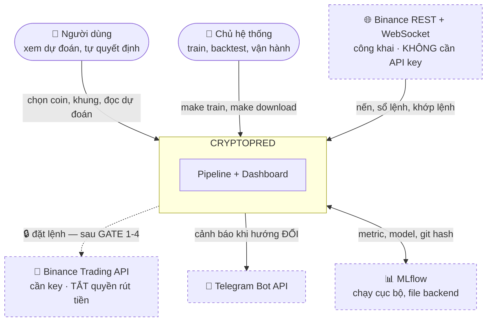

**Ranh giới trách nhiệm:** hệ thống **không** đưa ra khuyến nghị đầu tư. Nó công bố xác suất đã hiệu chỉnh kèm cỡ mẫu, và nói thật khi không biết. Quyết định là của người dùng.

---

## 2. BẢN ĐỒ CONTAINER

Ba lớp triển khai độc lập, ba nhịp chạy khác nhau.

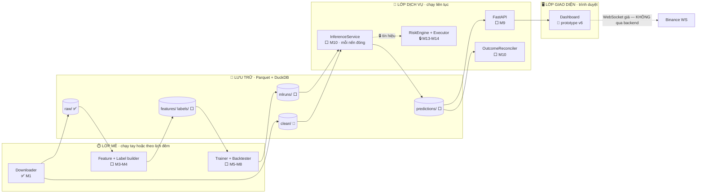

**Vì sao tách ba lớp:** lớp mẻ có thể chạy hàng giờ mà không ảnh hưởng gì; lớp dịch vụ phải sống 24/7 nhưng làm rất ít việc; lớp giao diện phải mượt kể cả khi hai lớp kia chết. Ranh giới này quyết định thiết kế §5.

---

## 3. KIẾN TRÚC PIPELINE CHI TIẾT

Toàn bộ đường đi từ nến thô tới lệnh. Sơ đồ này đồng thời là bản đồ tiến độ.

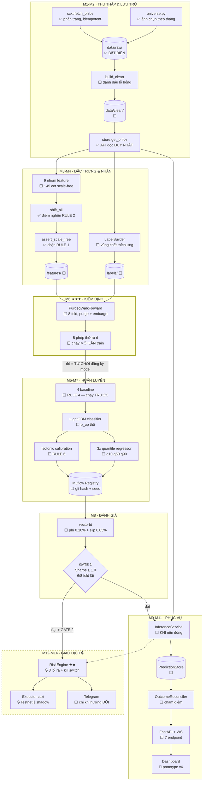

**Ba điểm nghẽn cố ý trong sơ đồ:**

1. `shift_all` là **cửa duy nhất** để feature đi vào model — không có đường vòng, RULE 2 không thể bị lách vì quên.
2. Bộ dò rò rỉ nằm **giữa** kiểm định và huấn luyện, đỏ thì MLflow từ chối đăng ký model. Không phải một bước tuỳ chọn ai đó nhớ thì chạy.
3. `GATE 1` là cửa duy nhất từ nhánh nghiên cứu sang nhánh phục vụ và nhánh giao dịch.

---

## 4. MÔ HÌNH DỮ LIỆU

### 4.1 Quan hệ thực thể

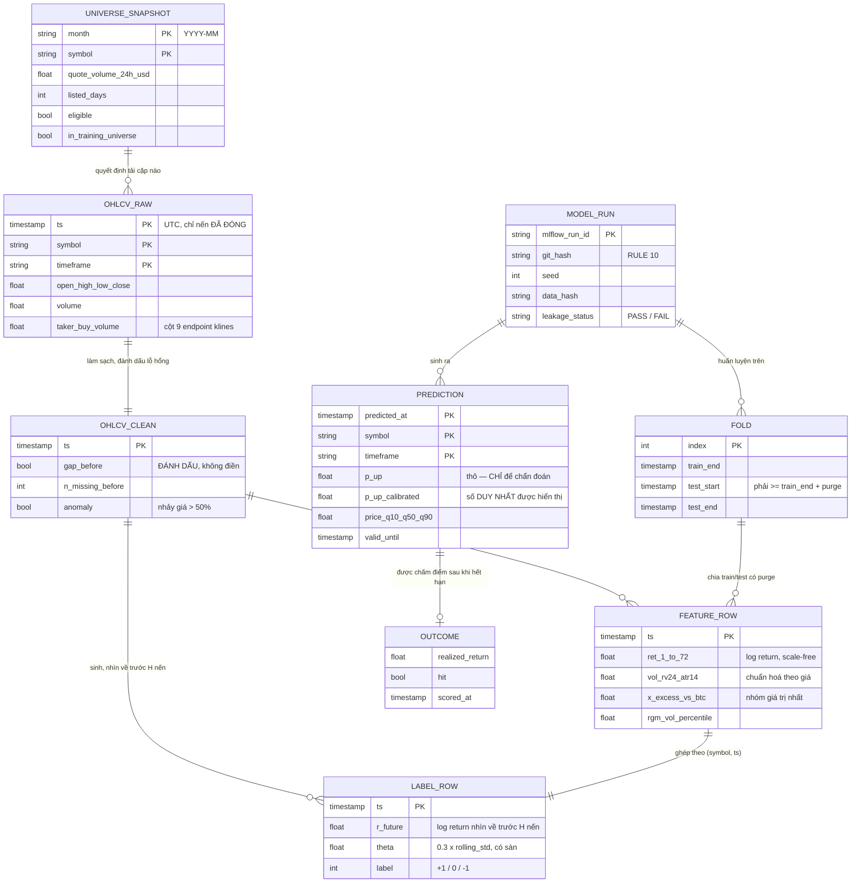

### 4.2 Bố cục trên đĩa

```
data/
├── raw/                                    ✅ BẤT BIẾN — tải lại được bất cứ lúc nào
│   ├── ohlcv/symbol=BTCUSDT/timeframe=1h/year=2026/data.parquet
│   └── universe/month=2026-08/universe.parquet
├── clean/  🔨   ohlcv/symbol=.../timeframe=.../year=...
├── features/ ⬜ symbol=.../timeframe=.../year=...
├── labels/   ⬜ horizon=4/symbol=.../year=...
└── predictions/ ⬜ timeframe=1h/year=2026/predictions.parquet
```

**Ba luật của mô hình dữ liệu:**

| Luật | Vì sao |
|---|---|
| `raw/` không bao giờ bị sửa | Mọi lỗi sửa từ `clean/` trở đi. Nghi ngờ thì xoá `clean/` xuống và dựng lại. |
| Lỗ hổng được **đánh dấu**, không điền | Điền giá vào nến sàn không có = bịa dữ liệu. Module sau tự quyết xử lý thế nào. |
| Phân vùng theo `symbol/timeframe/year` | DuckDB đọc thẳng Parquet, truy vấn 1 năm nến 1h dưới 200 ms mà không cần database server. |

---

## 5. BA ĐƯỜNG DỮ LIỆU REALTIME

Điểm mấu chốt của thiết kế, và chỗ hầu hết dashboard dự đoán làm sai.

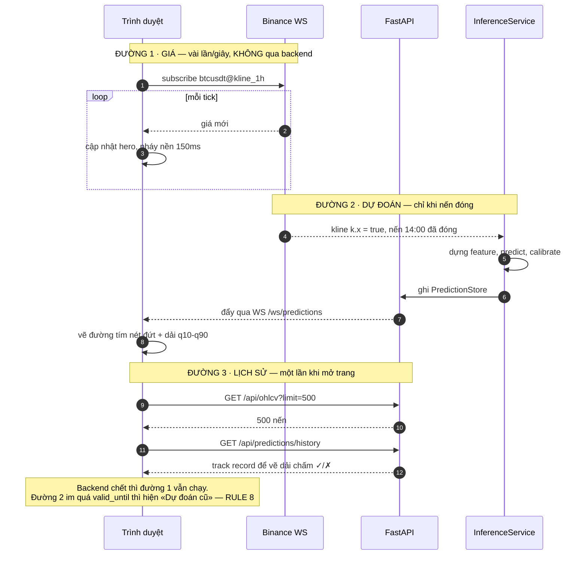

**Vì sao không chạy inference mỗi giây:** trong một nến chưa đóng, đầu vào của model gần như không đổi — chạy lại chỉ tạo ra một con số rung lắc gây hiểu lầm rằng model đang "suy nghĩ lại". Nó không suy nghĩ lại; nó đang nhìn cùng một dữ liệu.

### 5.1 Máy trạng thái độ tươi (RULE 8)

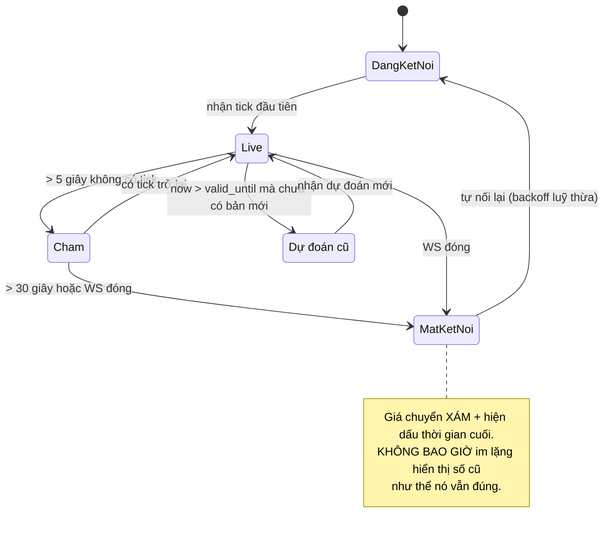

---

## 6. VÒNG ĐỜI MỘT DỰ ĐOÁN

Từ lúc nến đóng tới lúc con số được chấm đúng/sai. Vòng khép kín này nuôi `/api/accuracy`, dải track record trên chart, và tầng audit trôi hiệu chỉnh.

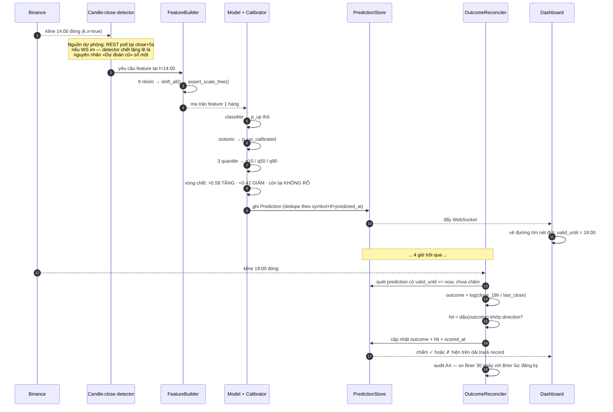

**Hai thứ vòng này bắt buộc phải có mà nhiều hệ thống bỏ quên:**

- **Dedupe** — chạy lại service không được tạo dự đoán trùng cho cùng một nến. Cùng triết lý với downloader idempotent ở M1.
- **Chấm điểm tự động** — nếu phải chấm tay, sau hai tuần sẽ không ai chấm nữa, và `/api/accuracy` trở thành con số bịa.

---

## 7. KIỂM ĐỊNH — PURGED WALK-FORWARD ★

Thư viện `mlfinlab` từng làm sẵn việc này **đã đóng mã nguồn**. Không còn lựa chọn OSS nào — phải tự viết. Đây chính xác là thứ quyết định repo nói thật hay nói dối.

### 7.1 Bố trí fold theo thời gian

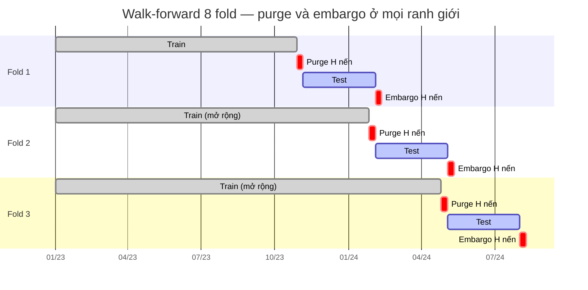

**Toán chỉ số chính xác:**

```
n = len(index);  test_len = (n − min_train) // n_folds

fold k (0-based):
    test_start = min_train + k · test_len
    test_end   = min_train + (k+1) · test_len
    train      = [0, test_start − purge)          ← purge cắt TRƯỚC test
    fold sau chỉ nhận thêm dữ liệu từ test_end + embargo trở đi
```

| Khái niệm | Cắt bao nhiêu | Vì sao |
|---|---|---|
| **Purge** | H nến cuối tập train | Nhãn của những nến đó nhìn vào vùng test. Không cắt = model đã thấy đáp án. |
| **Embargo** | H nến sau tập test | Tự tương quan không dừng lại đúng tại ranh giới; mẫu ngay sau test vẫn còn dính. |

**Ba bất biến được test:** `train_end + purge ≤ test_start` ở mọi fold · các tập test không giao nhau · tổng thời gian test ≥ 24 tháng khi `n_folds=8` (điều kiện của GATE 1).

### 7.2 Năm phép thử rò rỉ

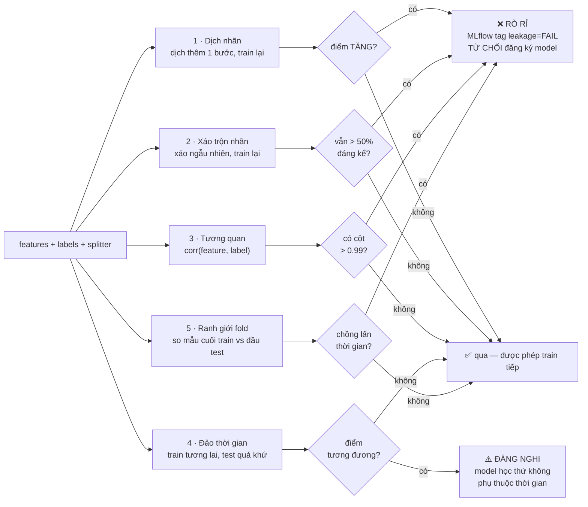

Bộ probe dùng **model proxy rẻ** (LightGBM 50 cây hoặc logistic) — mục tiêu là *phát hiện rò rỉ*, không phải điểm cao, nên phải chạy dưới 60 giây để nằm được trong mỗi lần train.

---

## 8. VÒNG HUẤN LUYỆN VÀ CỔNG CHẤT LƯỢNG

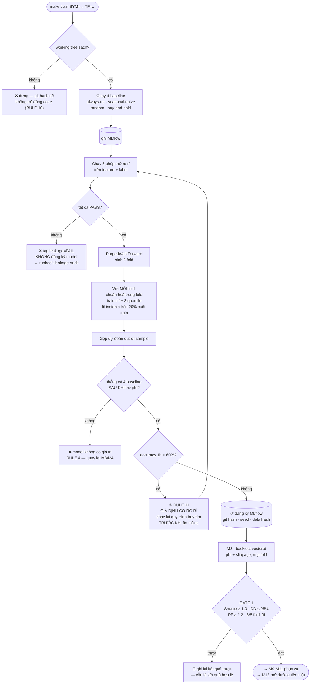

**Chi tiết dễ làm sai nhất trong vòng này:** chuẩn hoá (fit z-score) và fit isotonic phải nằm **bên trong** fold train. Fit trên toàn chuỗi rồi mới chia fold là rò rỉ — tinh vi và gần như vô hình trên biểu đồ.

---

## 9. MÁY TRẠNG THÁI CHẾ ĐỘ GIAO DỊCH

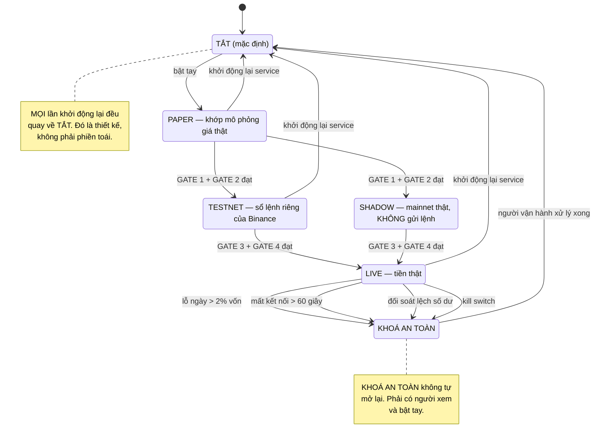

---

## 10. ĐƯỜNG TỚI TIỀN THẬT

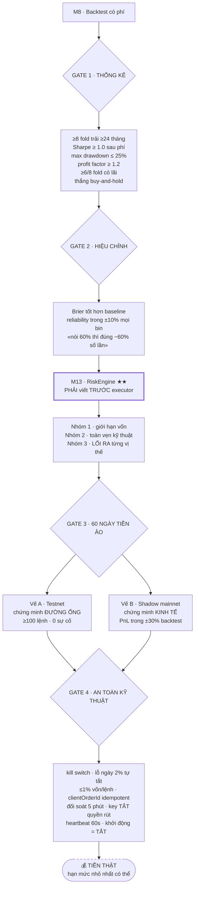

> **Không chấm PnL trên Testnet.** Testnet có sổ lệnh riêng và rất mỏng; giá ở đó không bám 1:1 giá thật. Sáu mươi ngày Testnet nói cho bạn biết **code có đúng không** — nó không nói gì về khớp lệnh, trượt giá hay lợi nhuận. Đó là việc của vế shadow.

**Nhóm 3 của M13 — lối ra, phần hay bị quên nhất:**

| Lối ra | Quy tắc |
|---|---|
| Stop-loss | 1.5 × ATR14, **đặt cùng lúc** với lệnh vào, không đặt sau |
| Hết hạn | Hết horizon (4 nến với khung 1h) mà chưa chạm mục tiêu → thoát theo giá thị trường |
| Tín hiệu tắt | Tín hiệu mới rơi vào vùng KHÔNG RÕ → đóng vị thế đang mở, không chờ |

> Định nghĩa lối ra **trước** khi viết lối vào. Một hệ thống biết khi nào vào mà không biết khi nào ra sẽ tích luỹ những vị thế không còn ai có lý do để giữ — và đó là cách phần lớn bot cá nhân thua sạch.

---

## 11. TRIỂN KHAI

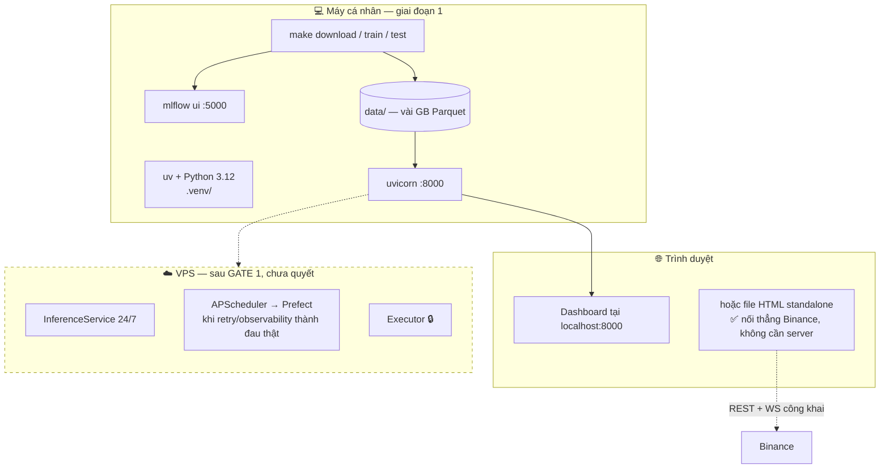

**Quyết định trì hoãn có chủ ý** (nguyên tắc S4 của `04_EXECUTION_STRATEGY`):

| Hạng mục | Trì hoãn tới | Vì sao |
|---|---|---|
| VPS / deploy | Sau GATE 1 | Model chưa thắng baseline thì deploy là trang trí |
| Prefect | Khi APScheduler thành đau thật | Không thêm hạ tầng trước khi có triệu chứng |
| MCP server | M9 | Trước đó chưa có API để bọc |
| GARCH | Sau GATE 1 | EWMA realized vol đủ cho position sizing |

---

## 12. PHỤ THUỘC MODULE VÀ ĐƯỜNG GĂNG

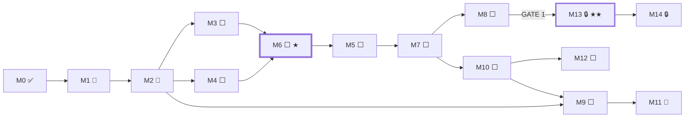

**Đường găng:** `M0 → M1 → M2 → M3 → M6 → M5 → M7 → M8`.

Mọi thứ khác làm song song hoặc trễ hơn được. **Nếu thời gian eo hẹp, cắt M11 (dashboard) trước — cắt M6 (kiểm định) là tự huỷ dự án.**

---

## 13. LỚP CẮT NGANG

### 13.1 Sáu tầng audit

Tầng nào đỏ thì tầng sau không còn ý nghĩa.

| Tầng | Chống | Kích hoạt | Hành động khi đỏ |
|---|---|---|---|
| **A0** lint/format | style trôi | mỗi lần sửa file | tự sửa tại chỗ |
| **A1** guardrail | RULE 1+2 bị lách | mỗi commit | **chặn commit** |
| **A2** 5 phép thử | rò rỉ tinh vi | **mỗi lần train** | tag `leakage=FAIL`, từ chối đăng ký |
| **A3** chất lượng dữ liệu | trôi dữ liệu | mỗi lần tải + snapshot tháng | không build clean |
| **A4** trôi hiệu chỉnh | «62%» hết đúng | hằng tuần | cờ «cần retrain» + Telegram |
| **A5** live vs backtest | tự lừa khâu cuối | hằng ngày khi shadow | **vấn đề ở backtest**, quay lại M8 |

> Chế độ hỏng nguy hiểm nhất của audit — giống RULE 8 của dashboard — là **không chạy mà không ai biết**. Vì vậy báo cáo sáng của M12 phải in cả dòng "audit A3/A4 lần cuối chạy lúc nào".

### 13.2 Xử lý lỗi theo tầng

| Tầng | Chế độ hỏng | Ứng xử |
|---|---|---|
| Tải dữ liệu | sàn sửa nến cũ | **ghi log chênh lệch**, giữ bản mới — không ghi đè lặng lẽ |
| Tải dữ liệu | lỗ hổng (sàn bảo trì) | đánh dấu, không điền |
| Tải dữ liệu | rate limit / mạng | retry backoff, một cặp lỗi không làm sập cả mẻ |
| Inference | model lỗi | **giữ dự đoán cũ + đánh dấu stale** — không bao giờ im lặng |
| Inference | detector nến đóng chết | nguồn dự phòng REST poll tại close+5s |
| Dashboard | mất WS | giá xám + dấu thời gian cuối, tự nối lại backoff |
| Executor 🔒 | mất kết nối > 60s | đóng vị thế hoặc chuyển KHOÁ AN TOÀN |
| Executor 🔒 | gửi lại lệnh | `clientOrderId` idempotent — không tạo lệnh mới |

### 13.3 Bảo mật

| Hạng mục | Quy tắc |
|---|---|
| Khoá API | Chỉ trong `.env` (đã gitignore). **Không bao giờ** log hay in giá trị. |
| Quyền của khoá | Bật giao dịch, **TẮT quyền rút tiền**, khoá theo IP. Không có ngoại lệ. |
| Dữ liệu thị trường | REST/WS công khai — không cần khoá. Đây là lý do dashboard chạy được từ file HTML. |
| Không commit | `.env` · `data/` · `mlruns/` — đã có trong `.gitignore` |
| Hook cưỡng chế | `PreToolUse` chặn mọi lệnh khớp `create_order` khi `TRADING_ENABLED≠true` |

---

## 14. NHỮNG QUYẾT ĐỊNH ĐÃ CHỐT VÀ CHƯA CHỐT

### Đã chốt (xem `docs/adr/`)

| # | Quyết định | Ghi ở |
|---|---|---|
| ADR-001 | Python 3.12 + uv · bố cục `src/` · stub nổ thay vì trả giá trị giả | `adr/001-skeleton.md` |
| — | PredictionStore = Parquet append + DuckDB, không thêm hạ tầng | `04 §1 G1` |
| — | OutcomeReconciler thuộc M10, là chủ quản việc chấm điểm | `04 §1 G2` |
| — | Chỉ báo causal tính một lần; **chuẩn hoá** mới phải per-fold | `04 §1 G5` |
| — | 3 model theo timeframe (1h/4h/1d), khác nhau chỉ ở config | `04 §1 G6` |
| — | `expected_vol_pct` = EWMA realized vol; GARCH là nâng cấp sau GATE 1 | `04 §1 G7` |

### Chưa chốt — chờ quyết định

| # | Câu hỏi | Ảnh hưởng |
|---|---|---|
| 1 | Ngưỡng thanh khoản: giữ 5 triệu USD/30 ngày (thực đo 422/474 cặp lọt qua) hay siết 150 triệu? | Kích thước vũ trụ coin, thời gian tải |
| 2 | Tải 40 cặp theo config hay 45–50 để dư? | Dung lượng, thời gian W1 |
| 3 | Trượt GATE 1 thì quay lại M3 (feature) hay M4 (nhãn) trước? | Nên quyết bằng đầu lạnh **trước khi** có kết quả |

---

*Tài liệu liên quan: `00_MASTER_PLAN.md` (hiến pháp) · `03_MODULE_SPECS.md` (DoD từng module) · `04_EXECUTION_STRATEGY.md` (WBS + audit) · `05_DASHBOARD_UX_PLAN.md` (UX) · `docs/design/system-map.html` (bản đồ trạng thái) · `docs/adr/` (quyết định kiến trúc)*
